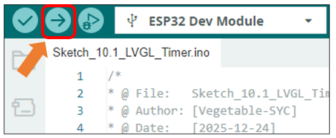
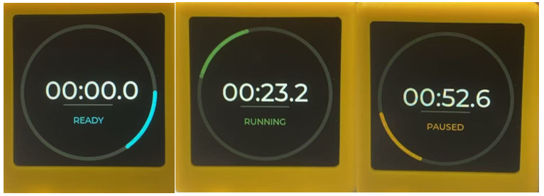

##############################################################################
Chapter 10 Lvgl Timer
##############################################################################

Project 10.1 Lvgl Timer
**********************************

Component List
==================================

.. list-table::
    :align: center
    :class: table-line

    * - Freenove ESP32 Mini TV x 1
      - USB data cable x 1

    * - |List04|
      - |List05|

.. |List04| image:: ../_static/imgs/List/List04.png
.. |List05| image:: ../_static/imgs/List/List05.png

Circuit
======================================

Connect Freenove ESP32 Mini TV to the computer with USB cable.

.. image:: ../_static/imgs/2_Touch/Chapter02_01.png
    :align: center

Sketch
=============================

Open **“Sketch_10.1_LVGL_Timer”** folder under **“Freenove_ESP32_Mini_TV\\Sketch”** and double-click **“Sketch_10.1_LVGL_Timer.ino”**. 

Sketch_10.1_LVGL_Timer
-----------------------------

The following is the program code:

.. literalinclude:: ../../../freenove_Kit/Sketch/Sketch_10.1_LVGL_Timer/Sketch_10.1_LVGL_Timer.ino
    :linenos: 
    :language: C
    :dedent:

Code Explanation
-----------------------------

Include the necessary header files

.. literalinclude:: ../../../freenove_Kit/Sketch/Sketch_10.1_LVGL_Timer/Sketch_10.1_LVGL_Timer.ino
    :linenos: 
    :language: C
    :lines: 7-8
    :dedent:

Preset capacitive touch related parameters

.. literalinclude:: ../../../freenove_Kit/Sketch/Sketch_10.1_LVGL_Timer/Sketch_10.1_LVGL_Timer.ino
    :linenos: 
    :language: C
    :lines: 11-14
    :dedent:

Define screen resolution

.. literalinclude:: ../../../freenove_Kit/Sketch/Sketch_10.1_LVGL_Timer/Sketch_10.1_LVGL_Timer.ino
    :linenos: 
    :language: C
    :lines: 18-19
    :dedent:

Draw the outer ring of the timer

.. literalinclude:: ../../../freenove_Kit/Sketch/Sketch_10.1_LVGL_Timer/Sketch_10.1_LVGL_Timer.ino
    :linenos: 
    :language: C
    :lines: 147-188
    :dedent:

Create a timer task

.. literalinclude:: ../../../freenove_Kit/Sketch/Sketch_10.1_LVGL_Timer/Sketch_10.1_LVGL_Timer.ino
    :linenos: 
    :language: C
    :lines: 191-191
    :dedent:

Enable screen power supply pin

.. literalinclude:: ../../../freenove_Kit/Sketch/Sketch_10.1_LVGL_Timer/Sketch_10.1_LVGL_Timer.ino
    :linenos: 
    :language: C
    :lines: 193-195
    :dedent:

Loop through UI tasks

.. literalinclude:: ../../../freenove_Kit/Sketch/Sketch_10.1_LVGL_Timer/Sketch_10.1_LVGL_Timer.ino
    :linenos: 
    :language: C
    :lines: 199-208
    :dedent:

Click **“Upload”** to upload the code to Freenove ESP32 Mini TV

Touch the capacitive touch area of the Freenove ESP32 Mini TV with your finger: 

**Short press: Start/Pause timer;** 

**Long press: Reset timer.**

