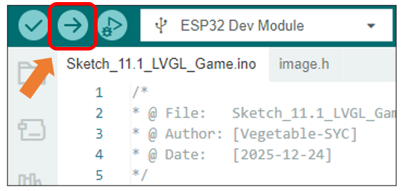
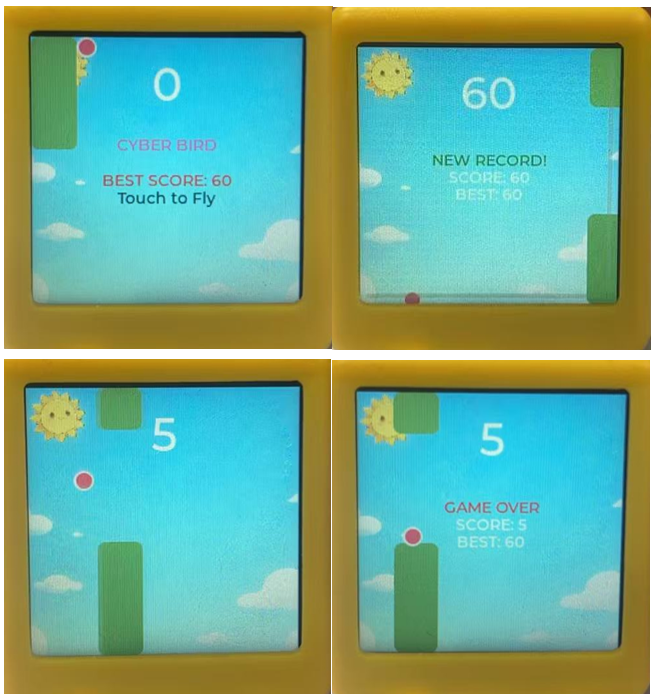

##############################################################################
Chapter 11 LVGL Game
##############################################################################

Having explored key concepts like EEPROM, capacitive touch, TFT display, and LVGL, we will now synthesize this knowledge to create a classic and entertaining mini-game: Flappy Bird.

Project 11.1 Lvgl Game
***********************************

Component List
==================================

.. list-table::
    :align: center
    :class: table-line

    * - Freenove ESP32 Mini TV x 1
      - USB data cable x 1

    * - |List04|
      - |List05|

.. |List04| image:: ../_static/imgs/List/List04.png
.. |List05| image:: ../_static/imgs/List/List05.png

Circuit
======================================

Connect Freenove ESP32 Mini TV to the computer with USB cable.

.. image:: ../_static/imgs/2_Touch/Chapter02_01.png
    :align: center

Sketch
=============================

Open **“Sketch_11.1_LVGL_Game”** folder under **“Freenove_ESP32_Mini_TV\\Sketch”** and double-click **“Sketch_11.1_LVGL_Game.ino”**.

Sketch_11.1_LVGL_Game
----------------------------

The following is the program code:

.. literalinclude:: ../../../freenove_Kit/Sketch/Sketch_11.1_LVGL_Game/Sketch_11.1_LVGL_Game.ino
    :linenos: 
    :language: C
    :dedent:

Click **“Upload”** to upload the code to Freenove ESP32 Mini TV

Game Rules
------------------------------

To start the game, tap the capacitive touch area after powering on the device. 

Control the ball by briefly tapping the touch zone to make it rise; release to let it fall. Navigate through obstacle pillars to score points—each successful pass earns one point. The game ends if the ball hits any obstacle or the screen edges.

A new high score is automatically saved to EEPROM and persists after restart, preserving your best achievement.

