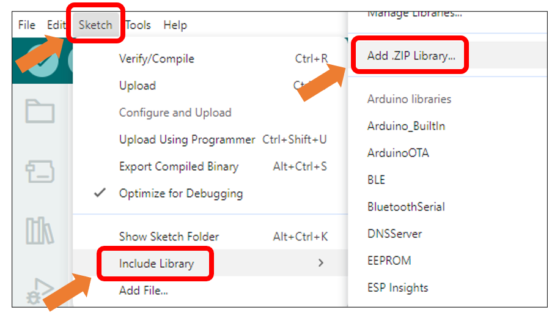
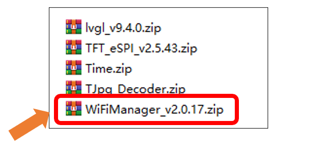
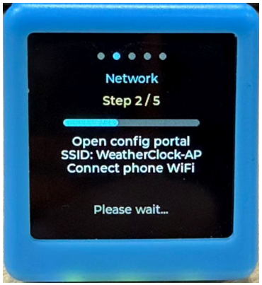
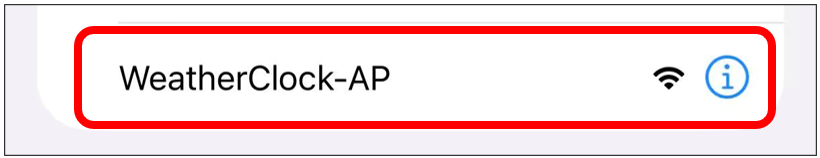
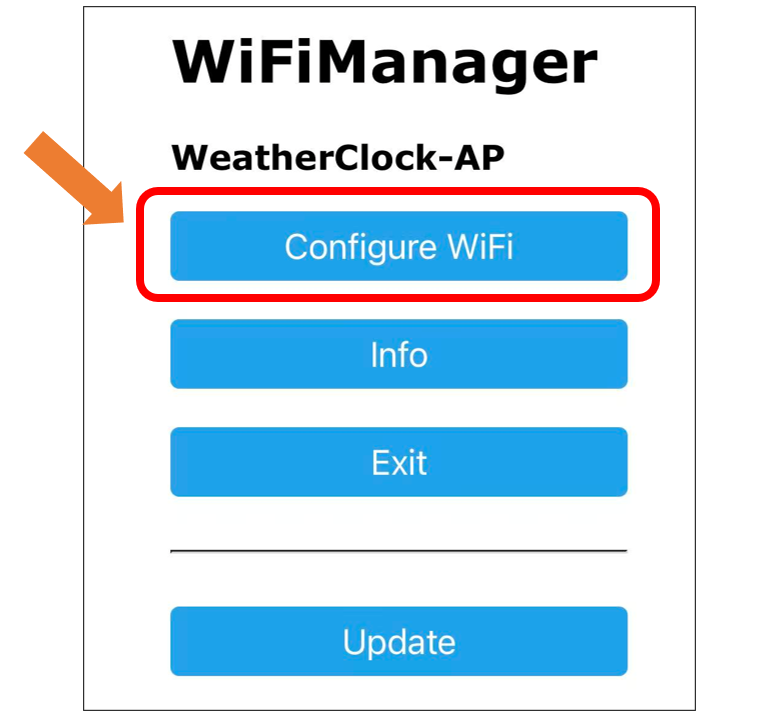
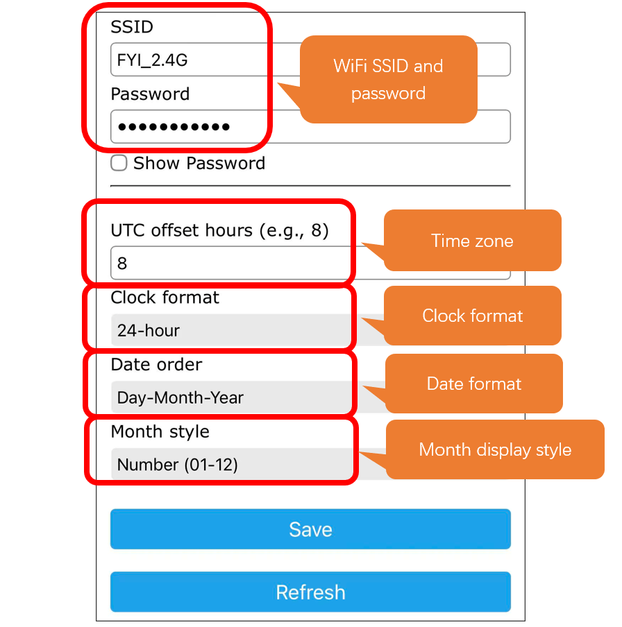
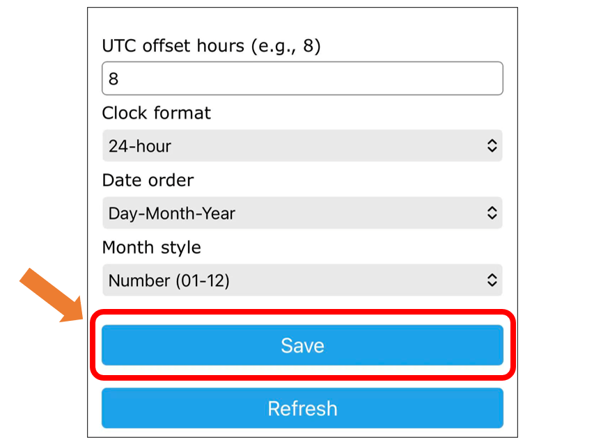
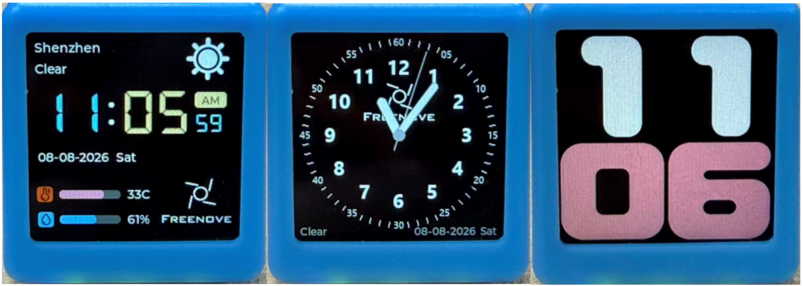

##############################################################################
Chapter 12 LVGL Weather Clock
##############################################################################

Project 12.1 Weather Clock
*************************************

Component List
==================================

.. list-table::
    :align: center
    :class: table-line

    * - Freenove ESP32 Mini TV x 1
      - USB data cable x 1

    * - |List04|
      - |List05|

.. |List04| image:: ../_static/imgs/List/List04.png
.. |List05| image:: ../_static/imgs/List/List05.png

Circuit
======================================

Connect Freenove ESP32 Mini TV to the computer with USB cable.

.. image:: ../_static/imgs/2_Touch/Chapter02_01.png
    :align: center

Sketch
========================

Open **"Sketch_12.1_LVGL_Weather_Clock"** folder under **"Freenove_ESP32_Mini_TV\\Sketch"** and double-click **"Sketch_12.1_LVGL_Weather_Clock.ino"**.

Install the needed libraries
-------------------------------------

Click **Sketch** -> **Include Library** -> **Add .ZIP Library...**

Select **WiFiManager_v2.0.17.zip**

Sketch_12.1_LVGL_Weather_Clock
-------------------------------------

The following is the program code:

.. literalinclude:: ../../../freenove_Kit/Sketch/Sketch_12.1_LVGL_Weather_Clock/Sketch_12.1_LVGL_Weather_Clock.ino
    :linenos: 
    :language: C
    :dedent:

Click **"Upload"** to upload the code to the Freenove ESP32 Mini TV

After the code is uploaded successfully, the Freenove ESP32 Mini TV will automatically enter WiFi configuration mode, as shown below:

Connect your phone or computer to the WiFi hotspot "WeatherClock-AP". No password is required for this hotspot.

After connecting, the following configuration page will automatically appear. If it does not appear, open a browser and visit 192.168.4.1.

Click **Configure WiFi**.

Configure the following parameters based on your actual settings:

Click Save to save the settings.

After the configuration is completed, the device will automatically connect to the Internet and retrieve weather information. **Please wait patiently during this process**.

The Freenove Weather Clock features three built-in clock faces and two themes (black and white), as shown below:

:combo:`red font-bolder:Tap the touch button to switch between clock faces. Press and hold the touch button for 3 seconds to switch between themes.`