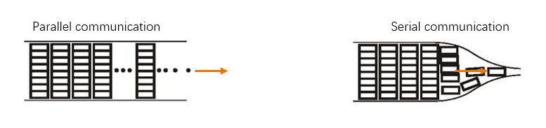
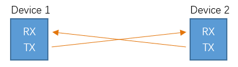
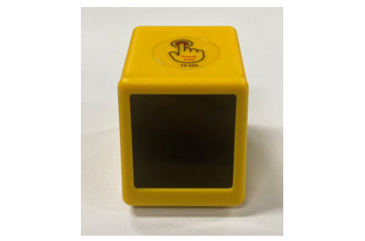
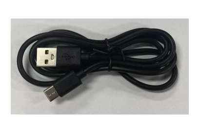
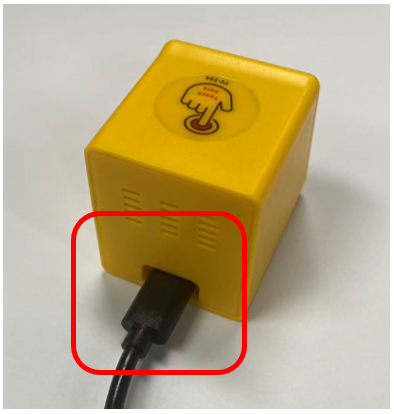
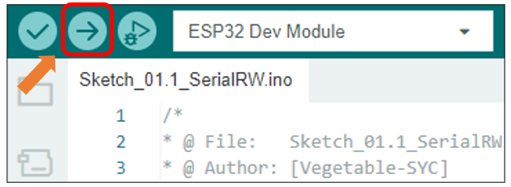
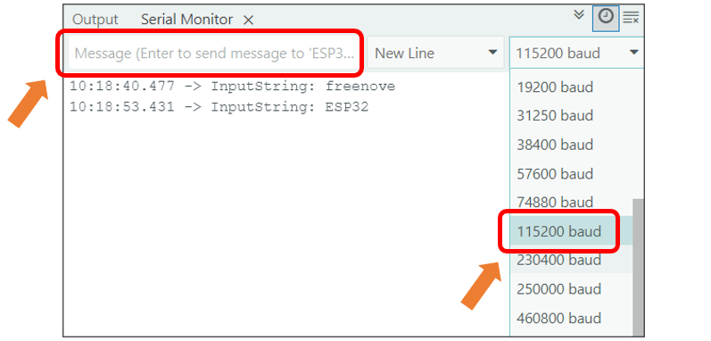

##############################################################################
Chapter 1 Serial
##############################################################################

Project 1.1 SerialRW
***********************************

Related Knowledge
===================================

Serial and parallel communication
-----------------------------------

Serial communication uses one data cable to transfer data one bit by another in turn, while parallel communication means that the data is transmitted simultaneously on multiple cables. Serial communication takes only a few cables to exchange information between systems, which is especially suitable for computers to computer, long distance communication between computers and peripherals. Parallel communication is faster, but it requires more cables and higher cost, so it is not appropriate for long distance communication.

Serial communication
-----------------------------------

Serial communication generally refers to the Universal Asynchronous Receiver/Transmitter (UART), which is commonly used in electronic circuit communication. It has two communication lines, one is responsible for sending data (TX line) and the other for receiving data (RX line). The serial communication connections of two devices use is as follows:

Before serial communication starts, the baud rate in both sides must be the same. Only use the same baud rate can the communication between devices be normal. The baud rates commonly used are 9600 and 115200.

Component List
===================================

.. list-table::
    :align: center
    :class: table-line

    * - Freenove ESP32 Mini TV x 1
      - USB data cable x 1

    * - |List04|
      - |List05|

Circuit
================================

Connect Freenove ESP32 Mini TV to the computer with USB cable.

Sketch
================================

Open **“Sketch_01.1_SerialRW”** folder under **“Freenove_ESP32_Mini_TV\\Sketch”** and double-click **“Sketch_01.1_SerialRW.ino”**.

Sketch_01.1_SerialRW
--------------------------------

.. literalinclude:: ../../../freenove_Kit/Sketch/Sketch_01.1_SerialRW/Sketch_01.1_SerialRW.ino
    :linenos: 
    :language: C
    :lines: 1-30
    :dedent:

Code Explanation
-------------------------------

Set the baud rate to 115200.

.. literalinclude:: ../../../freenove_Kit/Sketch/Sketch_01.1_SerialRW/Sketch_01.1_SerialRW.ino
    :linenos: 
    :language: C
    :lines: 11-11
    :dedent:

Determine whether there is data in the serial port buffer.

.. literalinclude:: ../../../freenove_Kit/Sketch/Sketch_01.1_SerialRW/Sketch_01.1_SerialRW.ino
    :linenos: 
    :language: C
    :lines: 18-18
    :dedent:

Receive serial port data and save it in the inputString string.

.. literalinclude:: ../../../freenove_Kit/Sketch/Sketch_01.1_SerialRW/Sketch_01.1_SerialRW.ino
    :linenos: 
    :language: C
    :lines: 19-20
    :dedent:

This code achieves the function of printing data on serial monitor. Click **“Upload”** to upload the code to Freenove ESP32 Mini TV.

After downloading the code, open the serial port monitor, and set the baud rate to **115200**, input any data in the messages bard and press Enter key, Freenove ESP32 Mini TV will print the received data.

:combo:`red font-bolder:Please note: This chapter does not involve the use of the screen. After the code for this chapter, the screen may not light up, which is normal and not a hardware malfunction. If you need to verify whether the screen is functioning properly, please refer to` :ref:`Chapter 6 <fnk0112/codes/main/6_tft:chapter 6 tft>` :combo:`red font-bolder:for testing.`

Reference
-------------------------------

.. c:function:: int available() 	

    Serial.available()checks the number of bytes currently available to read in the Serial receive buffer. It returns the number of bytes available (int type), or 0 if the buffer is empty.

.. c:function:: int read ()	

    Serial.read()reads one byte of data from the Serial receive buffer and returns it as an int. If no data is available to read, it returns -1.