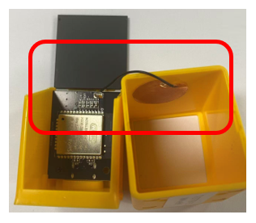
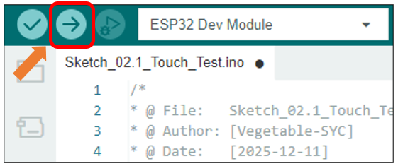
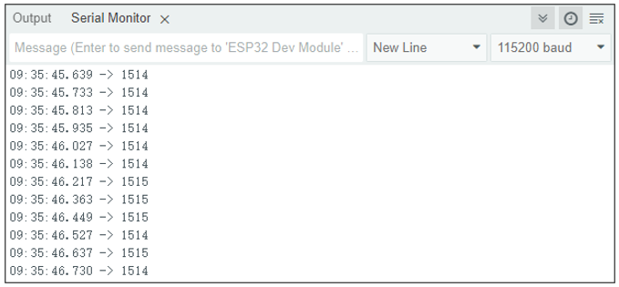
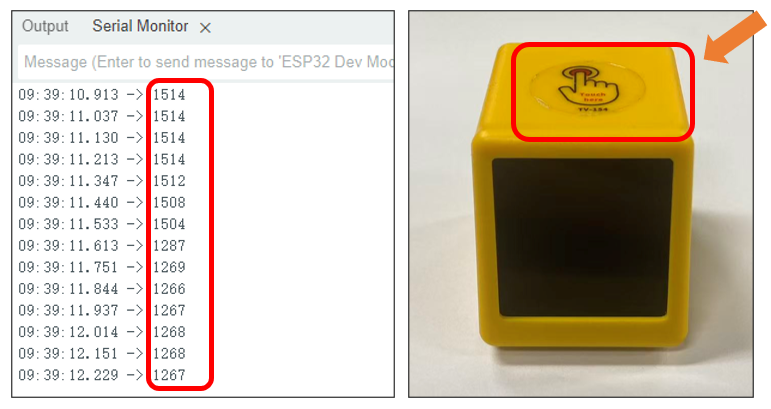
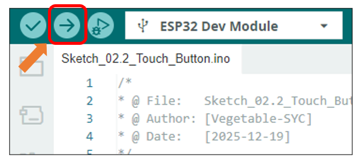
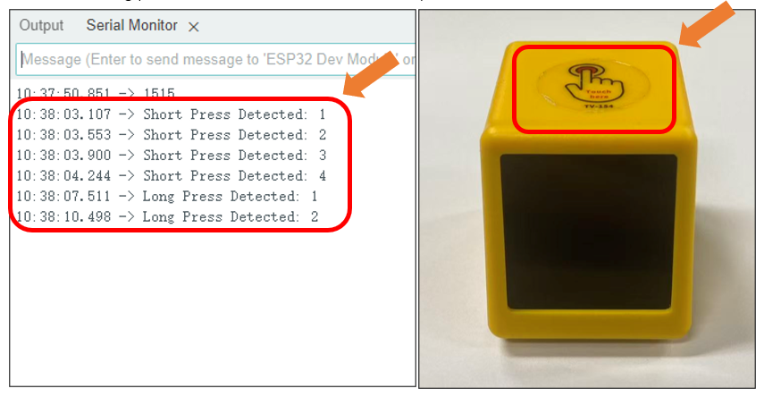

##############################################################################
Chapter 2 Touch
##############################################################################

Project 2.1 Touch Test
*********************************

Component List
===================================

.. list-table::
    :align: center
    :class: table-line

    * - Freenove ESP32 Mini TV x 1
      - USB data cable x 1

    * - |List04|
      - |List05|

.. |List04| image:: ../_static/imgs/List/List04.png
.. |List05| image:: ../_static/imgs/List/List05.png

Component knowledge
==================================

The fundamental principle of the ESP32's capacitive touch sensing is to monitor variations in the capacitance of its GPIO pins. Physically, a touch-capable pin and its associated sensing pad constitute an equivalent capacitor. The proximity of a human finger, which possesses inherent capacitance, increases the overall capacitance at the pin. For detection, the ESP32 employs an internal circuit to cycle through charging and discharging the pin at a high frequency. It records the number of pulses (the count of completed cycles) in a fixed duration. As a larger capacitance extends the charge/discharge time, the recorded pulse count within that period is correspondingly reduced.

Freenove ESP32 Mini TV utilizes capacitive touch sensing technology in its design. Internally, a wire connect the touch-sensitive pins to a copper foil pad affixed to the inside of the casing. This configuration transforms specific areas on the exterior shell into an active touch sensor, allowing the device to be controlled by simply tapping the designated spots on the casing.

Important Note: The internal disassembly diagram shown below is provided for illustrative purposes only. 

:red:`Disassembling the device yourself is strongly discouraged. The unit is secured with extremely small screws that are highly susceptible to being lost or damaged during removal, which can compromise the structural integrity of the device.`

Circuit
=================================

Connect Freenove ESP32 Mini TV to the computer with USB cable.

.. image:: ../_static/imgs/2_Touch/Chapter02_01.png
    :align: center

Sketch
===============================

Open **“Sketch_02.1_Touch_Test”** folder under **“Freenove_ESP32_Mini_TV\\Sketch”** and double-click **“Sketch_02.1_Touch_Test.ino”**.

Sketch_02.1_Touch_Test
-------------------------------

.. literalinclude:: ../../../freenove_Kit/Sketch/Sketch_02.1_Touch_Test/Sketch_02.1_Touch_Test.ino
    :linenos: 
    :language: C
    :lines: 1-19
    :dedent:

Code Explanation
-----------------------------

Set the baud rate to 115200.

.. literalinclude:: ../../../freenove_Kit/Sketch/Sketch_02.1_Touch_Test/Sketch_02.1_Touch_Test.ino
    :linenos: 
    :language: C
    :lines: 13-13
    :dedent:

Print capacitance values on the serial monitor

.. literalinclude:: ../../../freenove_Kit/Sketch/Sketch_02.1_Touch_Test/Sketch_02.1_Touch_Test.ino
    :linenos: 
    :language: C
    :lines: 17-17
    :dedent:

The purpose of this code is to display data on the serial monitor. Click “Upload” to upload the code to Freenove ESP32 Mini TV.

After downloading the code, open the serial port monitor, and set the baud rate to 115200

Touching the capacitive touch area of the Freenove ESP32 Mini TV with your finger will significantly reduce the capacitance reading.

:combo:`red font-bolder:Please note: Repeated testing has revealed that newer versions of the board support package may cause compatibility issues with certain peripherals. If abnormal serial port data transmission occurs, please use the more stable version 3.0.7.`

Project 2.2 Touch Button
**********************************

Building on the understanding of capacitive touch operation principles from the previous section, this part will focus on accurately distinguishing between short and long presses using these principles.

Component List
===============================

.. list-table::
    :align: center
    :class: table-line

    * - Freenove ESP32 Mini TV x 1
      - USB data cable x 1

    * - |List04|
      - |List05|

Circuit
===============================

Connect Freenove ESP32 Mini TV to the computer with USB cable.

.. image:: ../_static/imgs/2_Touch/Chapter02_01.png
    :align: center

Sketch
===============================

Open **“Sketch_02.2_Touch_Button”** folder under **“Freenove_ESP32_Mini_TV\\Sketch”** and double-click **“Sketch_02.2_Touch_Button.ino”**.

Sketch_02.2_Touch_Button
-------------------------------

.. literalinclude:: ../../../freenove_Kit/Sketch/Sketch_02.2_Touch_Button/Sketch_02.2_Touch_Button.ino
    :linenos: 
    :language: C
    :dedent:

Code Explanation
-------------------------------

Preset basic parameters

.. literalinclude:: ../../../freenove_Kit/Sketch/Sketch_02.2_Touch_Button/Sketch_02.2_Touch_Button.ino
    :linenos: 
    :language: C
    :lines: 7-9
    :dedent:

Set the baud rate to 115200.

.. literalinclude:: ../../../freenove_Kit/Sketch/Sketch_02.2_Touch_Button/Sketch_02.2_Touch_Button.ino
    :linenos: 
    :language: C
    :lines: 17-17
    :dedent:

Configure touch detection parameters.

.. literalinclude:: ../../../freenove_Kit/Sketch/Sketch_02.2_Touch_Button/Sketch_02.2_Touch_Button.ino
    :linenos: 
    :language: C
    :lines: 21-21
    :dedent:

Obtain capacitive touch reference value.

.. literalinclude:: ../../../freenove_Kit/Sketch/Sketch_02.2_Touch_Button/Sketch_02.2_Touch_Button.ino
    :linenos: 
    :language: C
    :lines: 24-24
    :dedent:

Continuously reading the capacitive touch values.

.. literalinclude:: ../../../freenove_Kit/Sketch/Sketch_02.2_Touch_Button/Sketch_02.2_Touch_Button.ino
    :linenos: 
    :language: C
    :lines: 30-30
    :dedent:

Determine if the difference between the current capacitive touch value and the reference value exceeds the preset touch threshold.

.. literalinclude:: ../../../freenove_Kit/Sketch/Sketch_02.2_Touch_Button/Sketch_02.2_Touch_Button.ino
    :linenos: 
    :language: C
    :lines: 37-37
    :dedent:

Determine if the touch duration exceeds the long-press time threshold.

.. literalinclude:: ../../../freenove_Kit/Sketch/Sketch_02.2_Touch_Button/Sketch_02.2_Touch_Button.ino
    :linenos: 
    :language: C
    :lines: 44-44
    :dedent:

The purpose of this code is to display data on the serial monitor. Click “Upload” to upload the code to Freenove ESP32 Mini TV.

After downloading the code, open the serial port monitor, and set the baud rate to 115200

Touch on the capacitive area of the Freenode ESP32 Mini TV, if the duration exceeds 3 seconds, it is classfied as a long press; otherwise, it is considered a short press.

:combo:`red font-bolder:Please note: This chapter does not involve the use of the screen. After the code for this chapter, the screen may not light up, which is normal and not a hardware malfunction. If you need to verify whether the screen is functioning properly, please refer to` :ref:`Chapter 6 <fnk0112/codes/main/6_tft:chapter 6 tft>` :combo:`red font-bolder:for testing.`