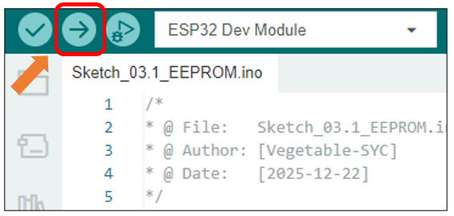
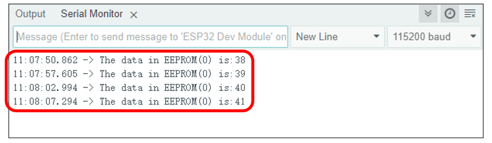

##############################################################################
Chapter 3 EEPROM
##############################################################################

Project 3.1 EEPROM
*****************************

Component List
==============================

.. list-table::
    :align: center
    :class: table-line

    * - Freenove ESP32 Mini TV x 1
      - USB data cable x 1

    * - |List04|
      - |List05|

.. |List04| image:: ../_static/imgs/List/List04.png
.. |List05| image:: ../_static/imgs/List/List05.png

Component knowledge
=============================

EEPROM
----------------------------

The primary function of EEPROM (Electrically Erasable Programmable Read-Only Memory) is to enable non-volatile data storage, ensuring critical information remains preserved after power loss or system restart. In the ESP32 architecture, EEPROM is not a physical chip but a logical storage space emulated using a section of the internal Flash memory. Due to the limited erase-write cycles of Flash memory, frequent repeated write operations should be avoided in practical applications.

Circuit
============================

Connect Freenove ESP32 Mini TV to the computer with USB cable.

.. image:: ../_static/imgs/2_Touch/Chapter02_01.png
    :align: center

Sketch
==============================

Open **“Sketch_03.1_EEPROM”** folder under **“Freenove_ESP32_Mini_TV\\Sketch”** and double-click **“Sketch_03.1_EEPROM.ino”**.

Sketch_03.1_EEPROM
------------------------------

.. literalinclude:: ../../../freenove_Kit/Sketch/Sketch_03.1_EEPROM/Sketch_03.1_EEPROM.ino
    :linenos: 
    :language: C
    :lines: 1-27
    :dedent:

Code Explanation
--------------------------------

Introduce the necessary libraries.

.. code-block:: c
    :linenos:
    :dedent:

    #include "EEPROM.h"

Define the size of non-volatile storage space (unit: bytes).

.. code-block:: c
    :linenos:
    :dedent:

    #define EEPROM_SIZE 1

Define the target starting address of the storage operation.

.. code-block:: c
    :linenos:
    :dedent:

    int addr = 0;

Set the baud rate to 115200.

.. code-block:: c
    :linenos:
    :dedent:

    Serial.begin(115200);

Initialize EEPROM and allocate buffer size

.. code-block:: c
    :linenos:
    :dedent:

    EEPROM.begin(EEPROM_SIZE);

Read the target address data and increment it by 1

.. code-block:: c
    :linenos:
    :dedent:

    int val = EEPROM.read(addr) + 1;

Write the new data to the memory buffer.

.. code-block:: c
    :linenos:
    :dedent:

    EEPROM.write(addr, val);

Update data to EEPROM.

.. code-block:: c
    :linenos:
    :dedent:

    EEPROM.commit();

The purpose of this code is to display data on the serial monitor. Click **“Upload”** to upload the code to Freenove ESP32 Mini TV.

After downloading the code, open the serial port monitor, and set the baud rate to 115200

After viewing the current value on the serial monitor, disconnect and then reconnect the USB cable. You will observe that the value stored in the EEPROM persists through the power cycle. Upon reinitialization after reboot, the value increments from its previously stored state.

:combo:`red font-bolder:Please note: This chapter does not involve the use of the screen. After the code for this chapter, the screen may not light up, which is normal and not a hardware malfunction. If you need to verify whether the screen is functioning properly, please refer to` :ref:`Chapter 6 <fnk0112/codes/main/6_tft:chapter 6 tft>` :combo:`red font-bolder:for testing.`
