##############################################################################
Chapter 4 BLE
##############################################################################

Project 4.1 BLE USART
****************************

Component List
===================

.. list-table::
    :align: center
    :class: table-line

    * - Freenove ESP32 Mini TV x 1
      - USB data cable x 1

    * - |List04|
      - |List05|

.. |List04| image:: ../_static/imgs/List/List04.png
.. |List05| image:: ../_static/imgs/List/List05.png

Component knowledge
================================

BLE(Bluetooth Low Energy)
--------------------------------

Low Energy Bluetooth (BLE) is a new feature introduced in the Bluetooth 4.0 specification, specifically designed for low-power devices and suitable for applications involving intermittent transmission of small amounts of data.  

The BLE architecture follows a client-server model and consists of the following key components:  

**GATT (Generic Attribute Protocol):** The foundational protocol for BLE communication, defining a hierarchical data structure of services and characteristics.  

**Service:** A collection of data that performs a specific function or feature, containing one or more characteristics.  

**Characteristic:** A specific data point within a service, consisting of a value and descriptors.  

**UUID:** A 128-bit universally unique identifier used to distinguish services and characteristics.  

BLE device can function simultaneously as a Peripheral (providing services) and a Central (connecting to peripherals). In this section, we will learn how to configure the Freenove ESP32 Mini TV as a peripheral device to provide services.

Circuit
==================================

Connect Freenove ESP32 Mini TV to the computer with USB cable.

.. image:: ../_static/imgs/2_Touch/Chapter02_01.png
    :align: center

Sketch
===================================

Open “Sketch_04.1_BLE_USART” folder under **“Freenove_ESP32_Mini_TV\\Sketch”** and double-click **“Sketch_04.1_BLE_USART.ino”**.

Sketch_04.1_BLE_USART
-----------------------------------

The following is the program code:

.. literalinclude:: ../../../freenove_Kit/Sketch/Sketch_04.1_BLE_USART/Sketch_04.1_BLE_USART.ino
    :linenos: 
    :language: C
    :lines: 1-79
    :dedent:

Code Explanation
---------------------------

Include the necessary header libraries.

.. literalinclude:: ../../../freenove_Kit/Sketch/Sketch_04.1_BLE_USART/Sketch_04.1_BLE_USART.ino
    :linenos: 
    :language: C
    :lines: 7-11
    :dedent:

Define service UUID and characteristic UUID.

.. literalinclude:: ../../../freenove_Kit/Sketch/Sketch_04.1_BLE_USART/Sketch_04.1_BLE_USART.ino
    :linenos: 
    :language: C
    :lines: 19-21
    :dedent:

The MyServerCallbacks class handles device connection and disconnection events and updates the deviceConnected status.

.. literalinclude:: ../../../freenove_Kit/Sketch/Sketch_04.1_BLE_USART/Sketch_04.1_BLE_USART.ino
    :linenos: 
    :language: C
    :lines: 32-42
    :dedent:

The MyServerCallbacks class handles the received data and save them to the rxload string.

.. literalinclude:: ../../../freenove_Kit/Sketch/Sketch_04.1_BLE_USART/Sketch_04.1_BLE_USART.ino
    :linenos: 
    :language: C
    :lines: 32-42
    :dedent:

Set the baud rate to 115200.

.. literalinclude:: ../../../freenove_Kit/Sketch/Sketch_04.1_BLE_USART/Sketch_04.1_BLE_USART.ino
    :linenos: 
    :language: C
    :lines: 60-60
    :dedent:

BLE Device Initialization, Service Creation, and Characteristic Setup

.. literalinclude:: ../../../freenove_Kit/Sketch/Sketch_04.1_BLE_USART/Sketch_04.1_BLE_USART.ino
    :linenos: 
    :language: C
    :lines: 61-61
    :dedent:

The Loop function check the connection status and serial data every 100 milliseconds.

.. literalinclude:: ../../../freenove_Kit/Sketch/Sketch_04.1_BLE_USART/Sketch_04.1_BLE_USART.ino
    :linenos: 
    :language: C
    :lines: 64-79
    :dedent:

LightBlue
----------------------------

If you do not have this software installed on your phone, you can refer to this link:

https://apps.apple.com/us/app/lightblue/id557428110

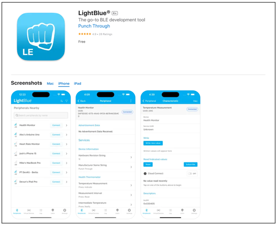

Click **“Upload”** to upload the code to Freenove ESP32 Mini TV.

:combo:`red font-bolder:Please note: This chapter does not involve the use of the screen. After the code for this chapter, the screen may not light up, which is normal and not a hardware malfunction. If you need to verify whether the screen is functioning properly, please refer to` :ref:`Chapter 6 <fnk0112/codes/main/6_tft:chapter 6 tft>` :combo:`red font-bolder:for testing.`

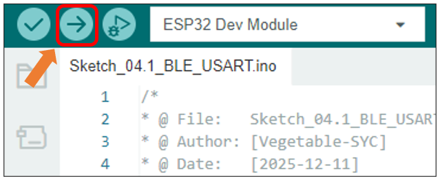

Turn ON Bluetooth on your phone, and open the LightBlue APP.

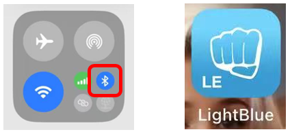

In the Scan page, swipe down to refresh the name of Bluetooth that the phone searches for. Click the Connection button of ESP32_BLE.

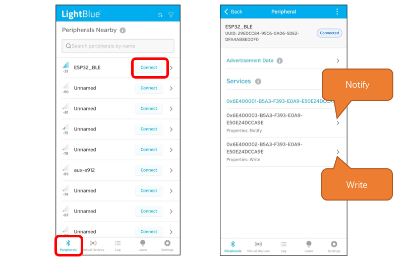

Receiving Data 
^^^^^^^^^^^^^^^^^^^^^^^

Click Notify

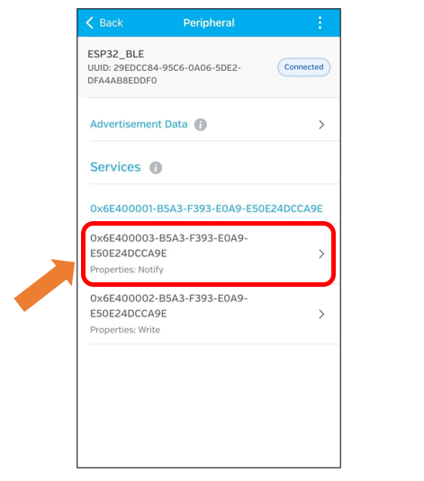

Click the top right corner to change the string type.

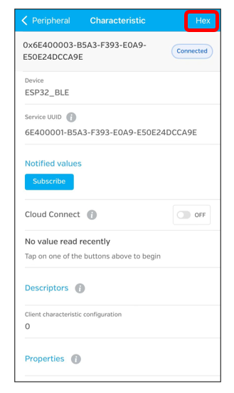

Select UTF-8 String, and click “Save”.

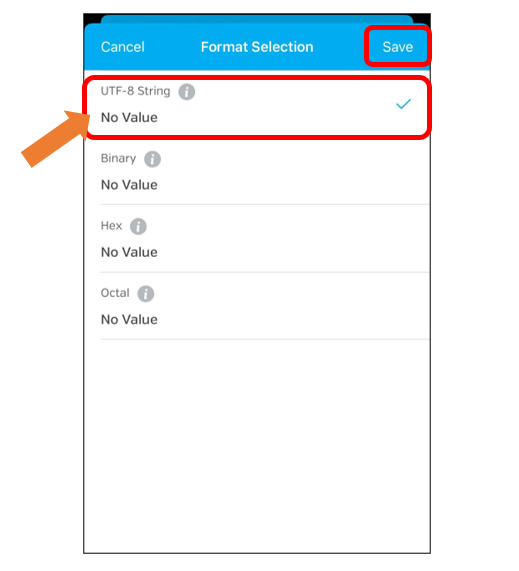

Click Subscribe

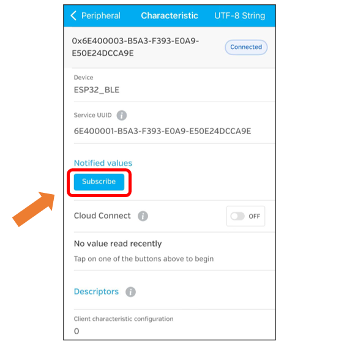

Send data on the serial monitor.

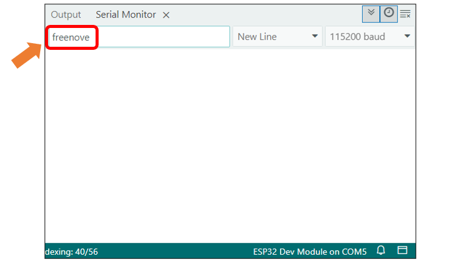

Data will be received on the LightBlue app.

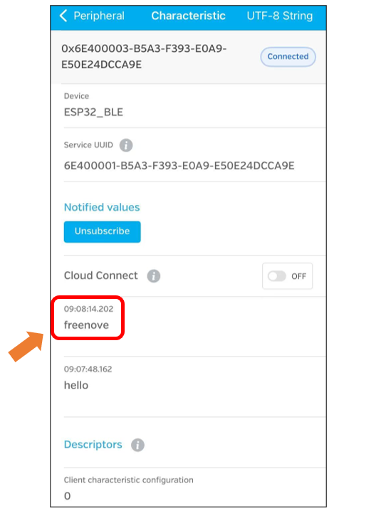

Sending Data
^^^^^^^^^^^^^^^^^^^^^^^

Click Write

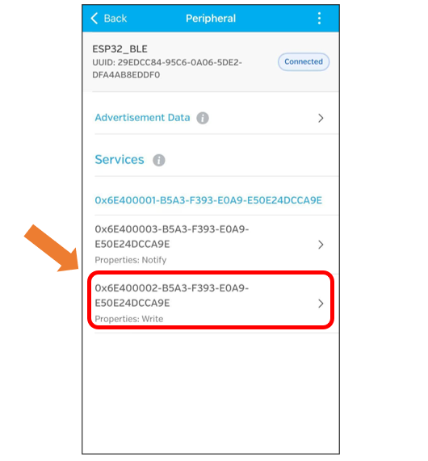

Click the top right corner to change the string type.

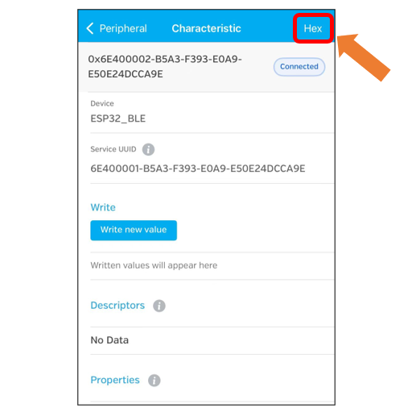

Select UTF-8 String and click “Save”.

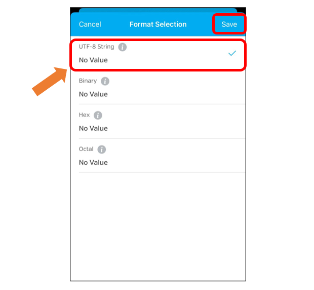

Click “Write new value”

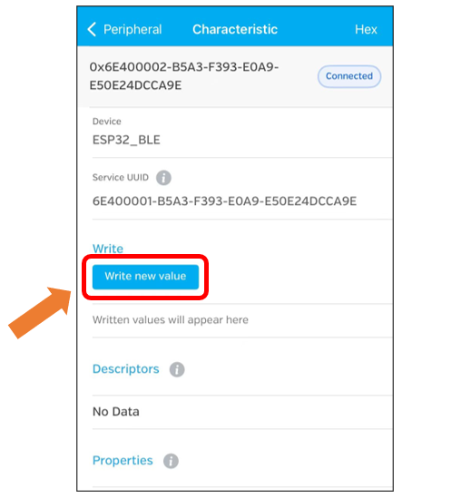

Enter the messages to send.

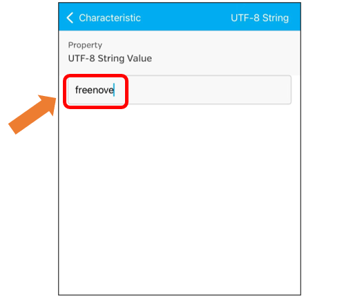

**Set the baud rate to 115200**, and the serial monitor will print the data received.

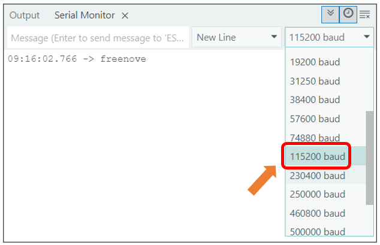