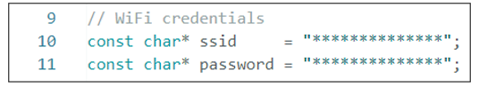
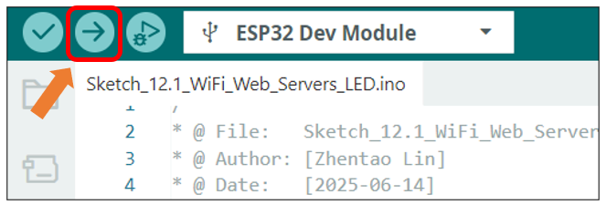
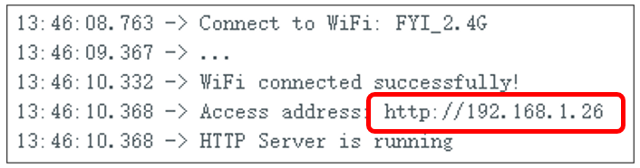
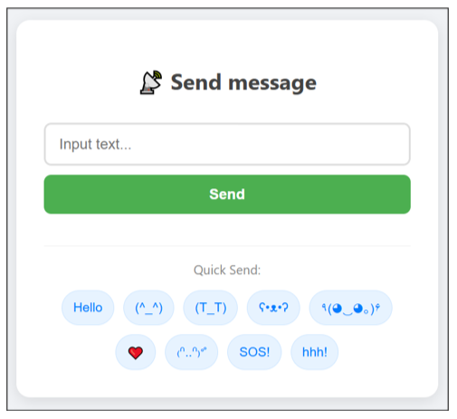
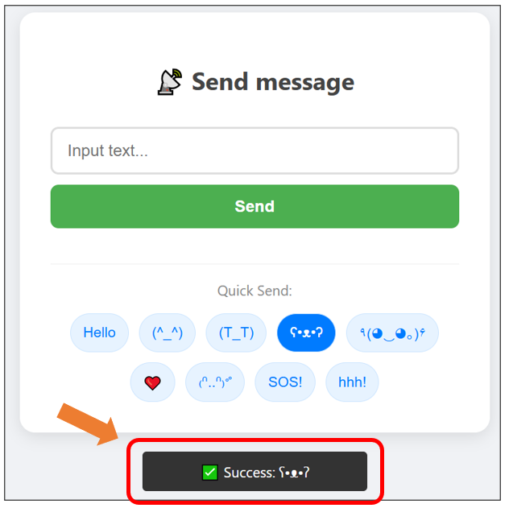
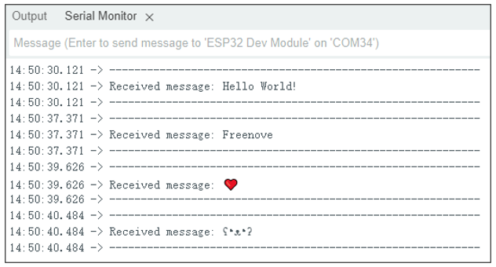

##############################################################################
Chapter 5 WIFI
##############################################################################

Project 5.1 WIFI Web Servers LED
******************************************

Component List
===================

.. list-table::
    :align: center
    :class: table-line

    * - Freenove ESP32 Mini TV x 1
      - USB data cable x 1

    * - |List04|
      - |List05|

.. |List04| image:: ../_static/imgs/List/List04.png
.. |List05| image:: ../_static/imgs/List/List05.png

Component Knowledge
======================================

Wi-Fi
--------------------------

Wi-Fi is a wireless LAN (WLAN) technology compliant with the IEEE 802.11 standard, enabling devices to transmit data or connect to the internet via radio waves within short-range coverage (typically up to tens of meters). In embedded systems, Wi-Fi modules provide wireless communication capabilities, allowing devices to connect to routers, access cloud services, or interact with other devices. 

Its core features include:

* Wireless connectivity (eliminating the need for physical cabling)

* Moderate to high-speed data transfer (depending on protocol versions such as 802.11n/ac)

* Secure communication (ensured by encryption protocols like WPA2/WPA3)

In embedded development, Wi-Fi is one of the key technologies for enabling IoT (Internet of Things) device connectivity.

Web
------------------------

The Web (World Wide Web) is an internet-based information system that integrates global resources through hypertext links. In the embedded field, Web technology refers to devices equipped with lightweight built-in web servers, allowing users to remotely access the device interface via browsers (such as Chrome or Edge). By entering the device's IP address, users can open an interactive page to perform functions like status monitoring, parameter configuration, or firmware upgrades. Its core value lies in cross-platform compatibility (no need for dedicated software installation) and standardized protocols (HTTP/HTTPS), making it a mainstream solution for remote management of embedded devices.

HTML & CSS & JavaScript

* tags to define page elements, forming the foundational framework. In embedded web interfaces, HTML describes the layout of components such as device status displays and configuration forms.  

* CSS (Cascading Style Sheets) controls the visual presentation of web pages, including colors, fonts, spacing, and responsive layouts. Through CSS rules, developers style HTML elements into intuitive interactive interfaces. The combination of HTML and CSS enables the creation of lightweight device control pages without complex graphics libraries, reducing resource overhead in embedded systems.  

* JavaScript (a scripting language) adds dynamic behavior and interaction logic to web pages. In embedded web interfaces, JavaScript plays a crucial role: it responds to user actions and enables asynchronous communication with the device backend through technologies like AJAX or WebSocket. This allows the webpage to fetch real-time device status data, update displays without refreshing, and send control commands or configuration parameters—delivering a smooth and efficient remote management experience.

Circuit
=========================

Connect Freenove ESP32 Mini TV to the computer with USB cable.

.. image:: ../_static/imgs/2_Touch/Chapter02_01.png
    :align: center

Sketch
=========================

Open **“Sketch_04.1_BLE_USART”** folder under **“Freenove_ESP32_Mini_TV\\Sketch”** and double-click **“Sketch_04.1_BLE_USART.ino”**.

Sketch_04.1_BLE_USART
-------------------------

The following is the program code:

.. literalinclude:: ../../../freenove_Kit/Sketch/Sketch_05.1_WIFI_USART/Sketch_05.1_WIFI_USART.ino
    :linenos: 
    :language: C
    :dedent:

Code Explanation
--------------------------

Include the necessary header files.

.. literalinclude:: ../../../freenove_Kit/Sketch/Sketch_05.1_WIFI_USART/Sketch_05.1_WIFI_USART.ino
    :linenos: 
    :language: C
    :dedent:

Define WiFi name and password.

.. literalinclude:: ../../../freenove_Kit/Sketch/Sketch_05.1_WIFI_USART/Sketch_05.1_WIFI_USART.ino
    :linenos: 
    :language: C
    :lines: 13-14
    :dedent:

Create a web server instance that listens on HTTP port 80.

.. literalinclude:: ../../../freenove_Kit/Sketch/Sketch_05.1_WIFI_USART/Sketch_05.1_WIFI_USART.ino
    :linenos: 
    :language: C
    :lines: 17-17
    :dedent:

Connect WIFI.

.. literalinclude:: ../../../freenove_Kit/Sketch/Sketch_05.1_WIFI_USART/Sketch_05.1_WIFI_USART.ino
    :linenos: 
    :language: C
    :lines: 53-59
    :dedent:

Continuously listen for and process HTTP connection requests from clients.

.. literalinclude:: ../../../freenove_Kit/Sketch/Sketch_05.1_WIFI_USART/Sketch_05.1_WIFI_USART.ino
    :linenos: 
    :language: C
    :lines: 77-77
    :dedent:

Input correct WiFi(2.4GHz) SSID and password.

Click **“Upload”** to upload the code to Freenove ESP32 Mini TV, and set the baudrate to 115200.

When the serial monitor prints the following information, it means the network connection is successful. Use a mobile phone or computer browser to open the IP address printed by the serial monitor.

:combo:`red font-bolder:Please note: If it keeps printing dots, please confirm whether the WiFi is in the 2.4G band.`

The browser will display the following screen. You can click the shortcut below or enter your text in the text box and click "Send".

A notification message will pop up when the message is successfully sent.

The messages you sent will print on the serial monitor.

Reference
------------------------------

.. py:function:: server.begin()

    This function starts the server to monitor the port.

.. py:function:: server.available()

    This function is used to detect and return the connected client object.
