##############################################################################
Chapter 6 TFT
##############################################################################

Project 6.1 TFT_Display
****************************

Component List
===================

.. list-table::
    :align: center
    :class: table-line

    * - Freenove ESP32 Mini TV x 1
      - USB data cable x 1

    * - |List04|
      - |List05|

.. |List04| image:: ../_static/imgs/List/List04.png
.. |List05| image:: ../_static/imgs/List/List05.png

Component knowledge
================================

TFT Display
---------------------------

TFT (Thin Film Transistor) is an electronic component that serves as the foundation for TFT displays, the mainstream display technology in modern laptops and desktop computers. In these displays, each individual liquid crystal pixel is controlled by its own dedicated thin-film transistor embedded directly behind it. This architecture classifies TFT screens as a form of active-matrix LCD (AMLCD) technology.

As one of the finest LCD color displays available, TFT screens offer superior performance characteristics including rapid response times, exceptional brightness levels, and outstanding contrast ratios.

Circuit
=========================

Connect Freenove ESP32 Mini TV to the computer with USB cable.

.. image:: ../_static/imgs/2_Touch/Chapter02_01.png
    :align: center

Schematic
==========================

The schematic diagram for the TFT screen is shown below. It is important to note that the screen's power supply (LCD_VDD) and backlight (LEDA) are driven by two independent GPIO pins, and both are active-low. The complete schematic diagram is located in the same directory as this tutorial document.

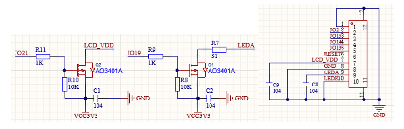

Sketch
============================

Open **“Sketch_06.1_TFT_Clock.ino”** folder under **“Freenove_ESP32_Mini_TV\\Sketches”** and double-click **“Sketch_06.1_TFT_Clock.ino”**.

Install Libraries
---------------------------

:combo:`red font-bolder:Caution: It is critical to follow the installation steps below precisely. Our provided library comes pre-configured for the display. Using a version downloaded online or keeping an old one will prevent the screen from working. Please ensure you completely replace any other version with this one to guarantee correct driver operation.`

Click **Sketch** -> **Include Library** -> **Add .ZIP Library...**

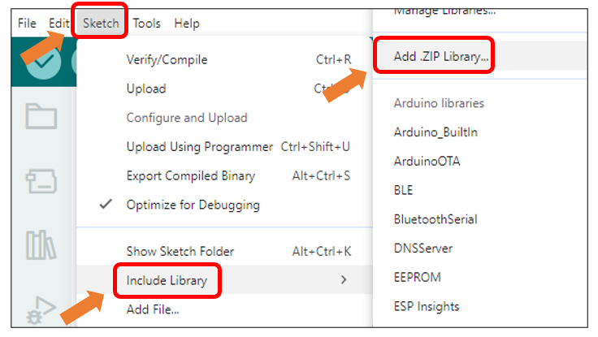

Install **TFT_eSPI_v2.5.43.zip**

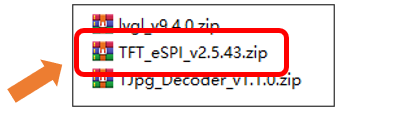

:combo:`red font-bolder:Note: Some libraries are not the latest version. Please do not update them even if it prompts every time you open the IDE. Just click LATER. Otherwise, it may lead to compilation failure.`

Sketch_06.1_TFT_Clock
----------------------------

The following is the program code:

.. literalinclude:: ../../../freenove_Kit/Sketch/Sketch_06.1_TFT_Display/Sketch_06.1_TFT_Display.ino
    :linenos: 
    :language: C
    :dedent:

Code Explanation
---------------------------

Include the necessary header files.

.. code-block:: c
    :linenos:
    :dedent:
    
    #include <TFT_eSPI.h>

Declare the TFT screen object.

.. code-block:: c
    :linenos:
    :dedent:
    
    TFT_eSPI tft = TFT_eSPI();

Enable screen power supply pin.

.. code-block:: c
    :linenos:
    :dedent:
    
    pinMode(TFT_VCC, OUTPUT);
    digitalWrite(TFT_VCC, LOW);

Initialize theTFT screen. 

.. code-block:: c
    :linenos:
    :dedent:
    
    tft.begin();
    tft.fillScreen(TFT_BLACK);

Fill with the color corresponding to the index.

.. code-block:: c
    :linenos:
    :dedent:
    
    tft.fillScreen(colors[colorIndex]);

Set text style and draw.

.. code-block:: c
    :linenos:
    :dedent:
    
    tft.setTextColor(TFT_BLACK);       // Set text color
    tft.setTextDatum(MC_DATUM);        // Set text datum to middle center
    tft.drawString("TFT Test", 120, 100, 4); // Draw text string

Update the index.

.. code-block:: c
    :linenos:
    :dedent:
    
    colorIndex++;
    if (colorIndex >= 5) {
        colorIndex = 0;
    }

Click **“Upload”** to upload the code to Freenove ESP32 Mini TV.

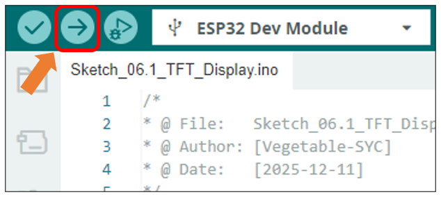

The TFT screen will change colors in the order of red -> green -> blue -> yellow -> purple, while displaying the text "TFT Text".

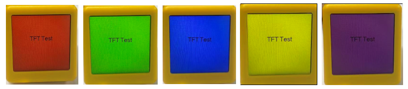

Project 6.2 TFT Picture
*******************************

Component List 
=========================

.. list-table::
    :align: center
    :class: table-line

    * - Freenove ESP32 Mini TV x 1
      - USB data cable x 1

    * - |List04|
      - |List05|

Component knowledge
==========================

DMA
------------------------

DMA, or Direct Memory Access, is a hardware feature that allows peripherals to transfer data to and from memory without needing the CPU to be directly involved, dramatically improving overall system efficiency while minimizing processor workload.

The core mechanism of DMA relies on a dedicated DMA controller taking over data transfer tasks. The CPU only needs to initialize the transfer parameters before offloading the operation, allowing computation and I/O operations to proceed in parallel.

Circuit
==========================

Connect Freenove ESP32 Mini TV to the computer with USB cable.

.. image:: ../_static/imgs/2_Touch/Chapter02_01.png
    :align: center

Sketch
==========================

Click **Sketch** -> **Include Library** -> **Add .ZIP Library...**

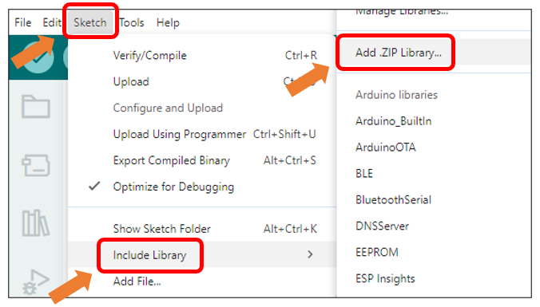

Install **TJpg_Decoder_v1.1.0.zip**

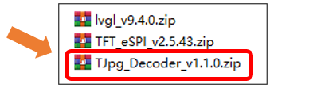

Open **“Sketch_06.2_TFT_Picture”** folder under **“Freenove_ESP32_Mini_TV\\Sketches”** and double-click **“Sketch_06.2_TFT_Picture.ino”**.

Sketch_06.2_TFT_Picture
---------------------------------

The following is the program code:

.. literalinclude:: ../../../freenove_Kit/Sketch/Sketch_06.2_TFT_Picture/Sketch_06.2_TFT_Picture.ino
    :linenos: 
    :language: C
    :dedent:

Code Explanation
--------------------------------

Include necessary header files.

.. code-block:: c
    :linenos:
    :dedent:
    
    #include <TFT_eSPI.h>  // TFT display library
    ...
    #include "image.h"         // Include raw JPEG image data array
    #include <TJpg_Decoder.h>  // Include JPEG decoder library

Configure DMA buffer

.. code-block:: c
    :linenos:
    :dedent:
    
    uint16_t dmaBuffer1[16 * 16];  // DMA buffer for 16x16 pixel block
    uint16_t dmaBuffer2[16 * 16];  // Second DMA buffer for toggling
    uint16_t* dmaBufferPtr = dmaBuffer1;
    bool dmaBufferSel = 0;

Create TFT object instance.

.. code-block:: c
    :linenos:
    :dedent:
    
    TFT_eSPI tft = TFT_eSPI();  // Create TFT object instance

.. literalinclude:: ../../../freenove_Kit/Sketch/Sketch_06.2_TFT_Picture/Sketch_06.2_TFT_Picture.ino
    :linenos: 
    :language: C
    :lines: 25-39
    :dedent:

Get JPG size.

.. code-block:: c
    :linenos:
    :dedent:
    
    TJpgDec.getJpgSize(&w, &h, img_asset, sizeof(img_asset));  // Get image dimensions

Draw images on the TFT screen.

.. code-block:: c
    :linenos:
    :dedent:
    
    tft.startWrite();
    TJpgDec.drawJpg(0, 0, img_asset, sizeof(img_asset));  // Draw the JPEG image
    tft.endWrite();

Click **“Upload”** to upload the code to Freenove ESP32 Mini TV

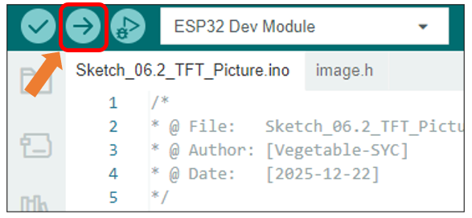

After the code is uploaded, an image will be displayed on the TFT screen

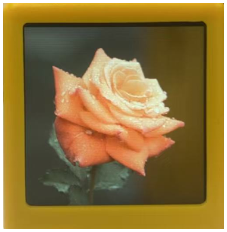

Custom image display
-------------------------------

You can customize the image displayed on the display according to your personal preferences.

First, open **Freenove_ESP32_Mini_TV\\Sketch\\Sketch_06.2_TFT_Picture\\TFT_img.html**

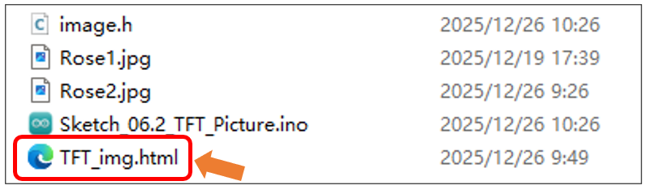

:combo:`red font-bolder:For optimal compatibility, please use Microsoft Edge or Google Chrome. You can open the file by dragging it directly into the browser window, or by right clicking it and selecting"Open with".`

**If you have any concerns, please feel free to contact us via** support@freenove.com

Click the **"Drag and drop any image"** area to select an image file, or directly drag and drop a file onto it.

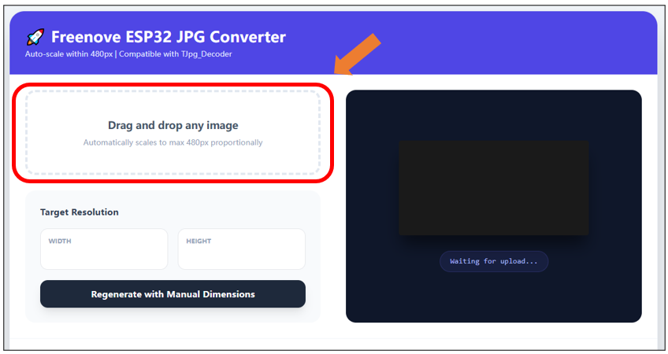

Set the resolution to 240x240.

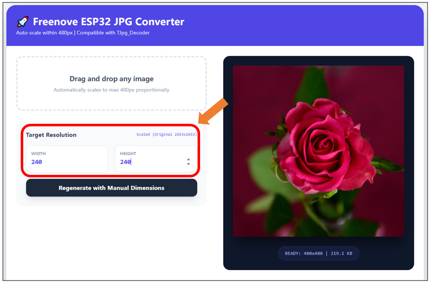

Click **”Regenerate with Manual Dimensions”** to generate arrays.

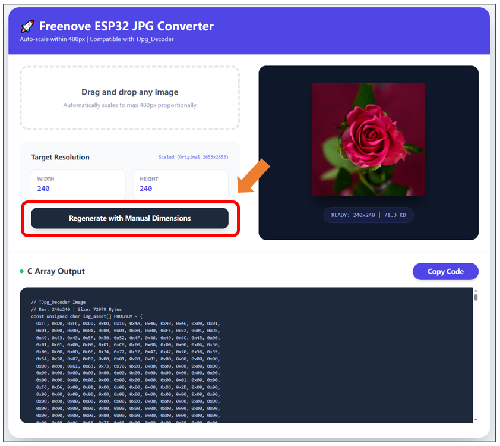

Click the **”Copy Code”** button to copy the arrays.

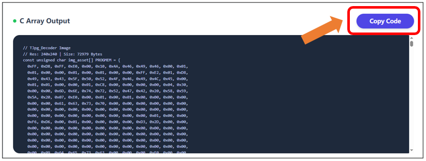

Replace all content in **image.h** with the copied arrays.

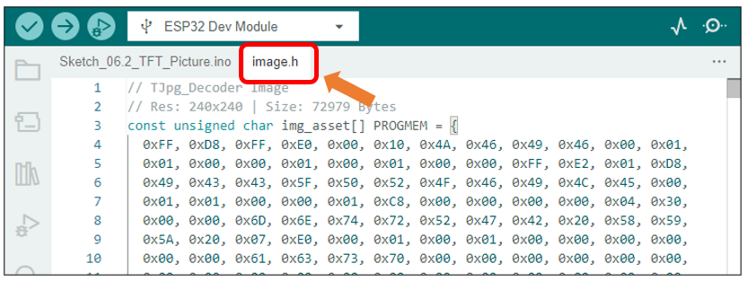

Upload the code and the custom image will be displayed.

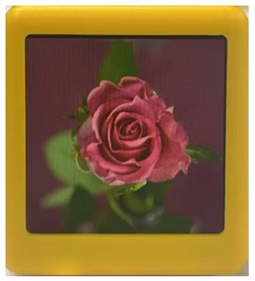

Project 6.3 TFT Clock
*********************************

Having explored key concepts such as EEPROM, Wi-Fi, capacitive touch, and TFT display in previous chapters, we will now synthesize this knowledge to create a practical and visually appealing classic project: a WiFi clock. Upon completing this chapter, you will be able to customize the interface to your preference.

Component List
==================================

.. list-table::
    :align: center
    :class: table-line

    * - Freenove ESP32 Mini TV x 1
      - USB data cable x 1

    * - |List04|
      - |List05|

Circuit
==================================

Connect Freenove ESP32 Mini TV to the computer with USB cable.

.. image:: ../_static/imgs/2_Touch/Chapter02_01.png
    :align: center

Sketch
==================================

Open “Sketch_06.3_TFT_Clock” folder under **“Freenove_ESP32_Mini_TV\\Sketch”** and double-click **“Sketch_06.3_TFT_Clock.ino”**.

Sketch_06.3_TFT_Clock
----------------------------------

The following is the program code:

.. literalinclude:: ../../../freenove_Kit/Sketch/Sketch_06.3_TFT_Clock/Sketch_06.3_TFT_Clock.ino
    :linenos: 
    :language: C
    :dedent:

Code Explanation
--------------------------------

Include the header file.

.. code-block:: c
    :linenos:
    :dedent:
    
    #include <TFT_eSPI.h>
    #include <WiFi.h>
    #include <WiFiUdp.h>
    #include <EEPROM.h>
    #include <TimeLib.h>
    #include <DNSServer.h>

Preset the required variables the time zone and author name can be modified here.

.. code-block:: c
    :linenos:
    :dedent:
    
    const char* ntpServer     = "pool.ntp.org";
    const int timeZone        = 8; 
    const char* AUTHOR_NAME   = "Freenove";
    const int TOUCH_THRESHOLD = 80;
    const int PRESS_TIME      = 3000;

Webpage interface design during network configuration

.. code-block:: cpp
    :linenos:
    :dedent:
    
    const char* CSS_BODY = R"raw(
    <style>
    …
    )raw";

Initialize the screen.

.. code-block:: c
    :linenos:
    :dedent:
    
    pinMode(TFT_VCC, OUTPUT);
    digitalWrite(TFT_VCC, LOW); 
    tft.begin();
    tft.setRotation(0);
    tft.fillScreen(COLOR_BG);

Initialize the capative touch.

.. code-block:: c
    :linenos:
    :dedent:
    
    touchSetCycles(0xf000, 0x1000);
    Touch_old_data = touchRead(TOUCH_PIN);

Click “Upload” to upload the code to Freenove ESP32 Mini TV

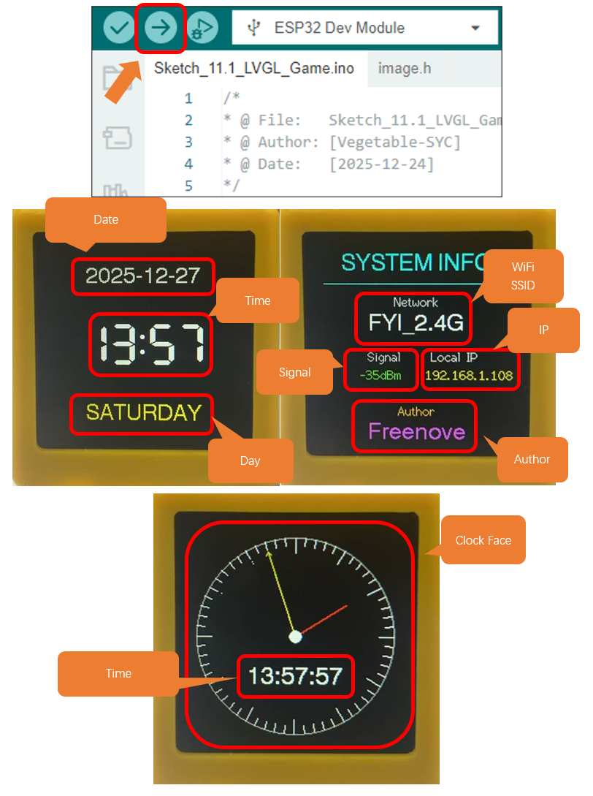

How to Use
--------------------------------

Upon first boot, the device requires network configuration. The WiFi credentials will be saved to EEPROM for automatic connection on subsequent startups. To reset or change the network, simply long-press the capacitive touch area for 3 seconds. This will clear the stored configuration and initiate the setup process again.

1. On first power-up, wait until the following interface appears. 

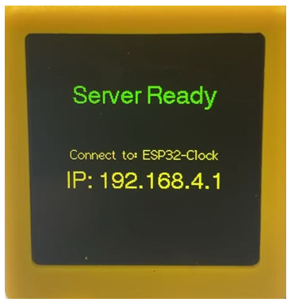

2. Connect to ESP32-Clock.

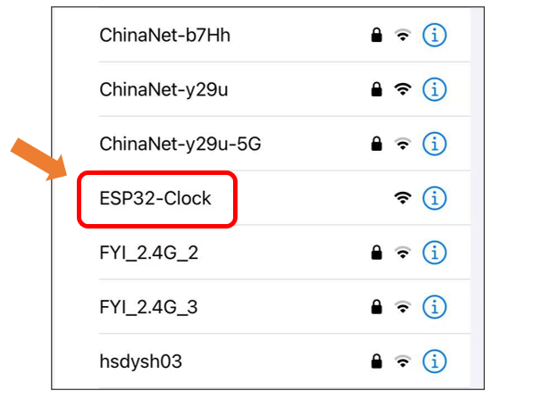

3. Wait for the network configuration page to appear.

:combo:`red font-bolder:Note: If the page does not load automatically, please open a browser and navigate to http://192.168.4.1.`

4. Select your WiFi network in the configuration page and enter the password. Click 

:combo:`red font-bolder:Important note: The WiFi network must be 2.4GHz; otherwise, the connection will fail.`

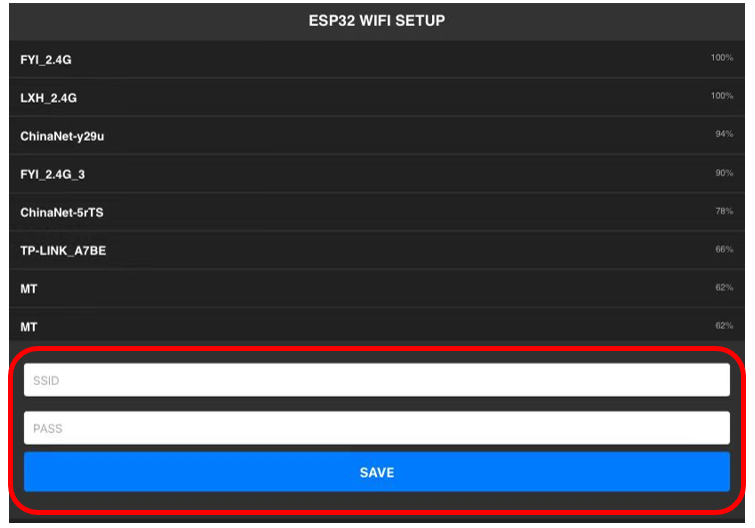

5. the following screen will be displayed. You can tap the capacitive touch area to switch between interfaces.  

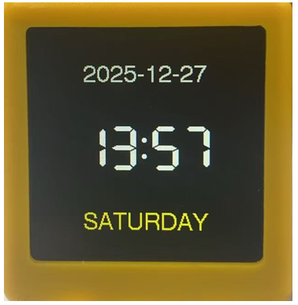