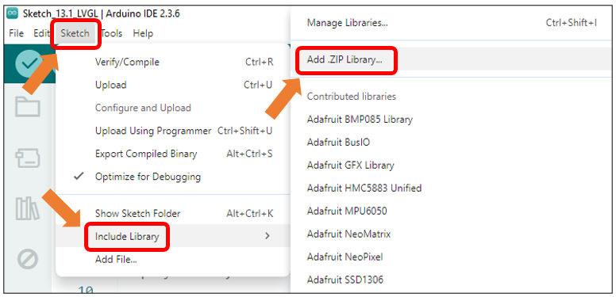
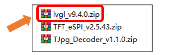
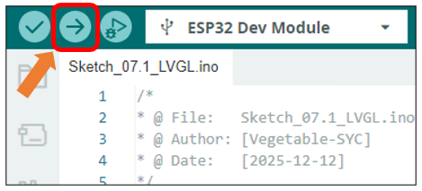
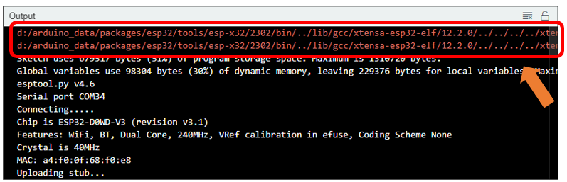
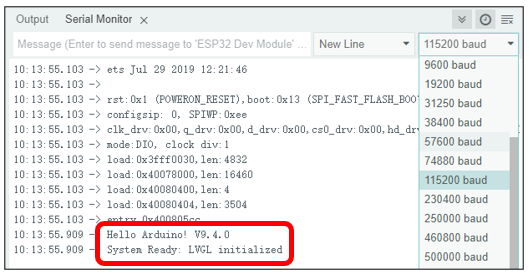
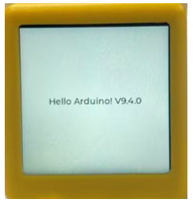

##############################################################################
Chapter 7 LVGL
##############################################################################

Project 7.1 LVGL
****************************

Component List 
===============================

.. list-table::
    :align: center
    :class: table-line

    * - Freenove ESP32 Mini TV x 1
      - USB data cable x 1

    * - |List04|
      - |List05|

.. |List04| image:: ../_static/imgs/List/List04.png
.. |List05| image:: ../_static/imgs/List/List05.png

Component knowledge

LVGL is a widely-used embedded GUI library that is implemented in pure C, making it highly portable and performant. It offers rich features and content, supporting both display and input devices such as touchscreens and keyboards.

.. table::
    :align: center
    :class: table-line

    +----+-----------------------------------------------------------------------------------------------------------------+
    |    | Features supported by LVGL                                                                                      |
    +----+-----------------------------------------------------------------------------------------------------------------+
    | 1  | Powerful building blocks such as buttons, charts, lists, sliders, images, and more.                             |
    +----+-----------------------------------------------------------------------------------------------------------------+
    | 2  | Advanced graphics with animation, anti-aliasing, opacity, and smooth scrolling.                                 |
    +----+-----------------------------------------------------------------------------------------------------------------+
    | 3  | Various input devices, such as touchpads, mice, keyboards, encoders, and more.                                  |
    +----+-----------------------------------------------------------------------------------------------------------------+
    | 4  | Multiple languages with UTF-8 encoding.                                                                         |
    +----+-----------------------------------------------------------------------------------------------------------------+
    | 5  | Multiple display types, including TFT and monochrome displays.                                                  |
    +----+-----------------------------------------------------------------------------------------------------------------+
    | 6  | Fully customizable graphical elements.                                                                          |
    +----+-----------------------------------------------------------------------------------------------------------------+
    | 7  | LVGL can be used independently of any microcontroller or display hardware.                                      |
    +----+-----------------------------------------------------------------------------------------------------------------+
    | 8  | Highly extensible and can be configured to use very little memory (e.g. 64 kB of flash and 16 kB of RAM)        |
    +----+-----------------------------------------------------------------------------------------------------------------+
    | 9  | It can be used with or without an operating system, and supports external memory and GPUs as optional features. |
    +----+-----------------------------------------------------------------------------------------------------------------+
    | 10 | Single-frame buffer operation, even with advanced graphics effects.                                             |
    +----+-----------------------------------------------------------------------------------------------------------------+
    | 11 | Written in C language to achieve maximum compatibility (compatible with C++ as well).                           |
    +----+-----------------------------------------------------------------------------------------------------------------+
    | 12 | LVGL has a simulator that allows for embedded GUI design on a PC without any embedded hardware.                 |
    +----+-----------------------------------------------------------------------------------------------------------------+
    | 13 | Resources to help developers quickly get started with the library, including tutorials, examples, and themes.   |
    +----+-----------------------------------------------------------------------------------------------------------------+
    | 14 | A wide range of resources.                                                                                      |
    +----+-----------------------------------------------------------------------------------------------------------------+

Circuit
=========================

Connect Freenove ESP32 Mini TV to the computer with USB cable.

.. image:: ../_static/imgs/2_Touch/Chapter02_01.png
    :align: center

Sketch
=========================

Install Libraries
-------------------------

Caution: It is critical to follow the installation steps below precisely to install the LVGL library. Our provided library comes pre-configured for the display. Using a version downloaded online or keeping an old one will prevent the screen from working. Please ensure you completely replace any other version with this one to guarantee correct driver operation.

Click **Sketch** -> **Include Library** -> **Add .ZIP Library...**

Install **lvgl_v9.4.0.zip**

Open **“Sketch_07.1_LVGL”** folder under **“Freenove_ESP32_Mini_TV\\Sketch”** and double-click **“Sketch_07.1_LVGL.ino”**.

Sketch_07.1_LVGL
---------------------------

The following is the program code:

.. literalinclude:: ../../../freenove_Kit/Sketch/Sketch_07.1_LVGL/Sketch_07.1_LVGL.ino
    :linenos: 
    :language: C
    :dedent:

Code Explanation
---------------------------

Include the header file.

.. literalinclude:: ../../../freenove_Kit/Sketch/Sketch_07.1_LVGL/Sketch_07.1_LVGL.ino
    :linenos: 
    :language: C
    :lines: 7-8
    :dedent:

Set the screen resolution.

.. literalinclude:: ../../../freenove_Kit/Sketch/Sketch_07.1_LVGL/Sketch_07.1_LVGL.ino
    :linenos: 
    :language: C
    :lines: 11-12
    :dedent:

Initialize the screen.

.. literalinclude:: ../../../freenove_Kit/Sketch/Sketch_07.1_LVGL/Sketch_07.1_LVGL.ino
    :linenos: 
    :language: C
    :lines: 41-41
    :dedent:

Initialize LVGL..

.. literalinclude:: ../../../freenove_Kit/Sketch/Sketch_07.1_LVGL/Sketch_07.1_LVGL.ino
    :linenos: 
    :language: C
    :lines: 41-41
    :dedent:

Create a text label and center it.

.. literalinclude:: ../../../freenove_Kit/Sketch/Sketch_07.1_LVGL/Sketch_07.1_LVGL.ino
    :linenos: 
    :language: C
    :lines: 59-61
    :dedent:

Enable the display's power supply pin.

.. literalinclude:: ../../../freenove_Kit/Sketch/Sketch_07.1_LVGL/Sketch_07.1_LVGL.ino
    :linenos: 
    :language: C
    :lines: 64-65
    :dedent:

Handles UI tasks in a continuous loop.

.. literalinclude:: ../../../freenove_Kit/Sketch/Sketch_07.1_LVGL/Sketch_07.1_LVGL.ino
    :linenos: 
    :language: C
    :lines: 70-72
    :dedent:

Click **“Upload”** to upload the code to Freenove ESP32 Mini TV. Set the baud rate to 115200.

:combo:`red font-bolder: Note: The following warning messages may appear in the console during compilation. They do not affect code execution and can be safely ignored.`

Successful initialization information will be displayed on the serial monitor.

You will see the text reading “Hello Arduino! V94.0” on the display.

Reference
-------------------------

.. c:function:: lv_display_t * lv_display_create(int32_t hor_res, int32_t ver_res);	
    
    This function is designed to create a device object with specified dimensions, define the canvas size, and return a handle to the object.

.. c:function:: lv_obj_t * lv_label_create(lv_obj_t * parent);	

    This function creates a text label component.

.. c:function:: void lv_label_set_text(lv_obj_t * obj, const char * text);	

    This function sets the static text to be displayed by the label control.
