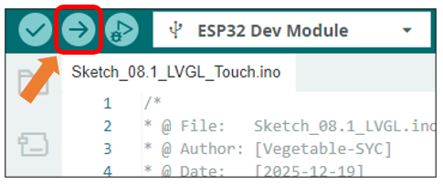
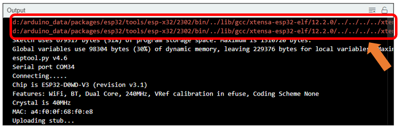
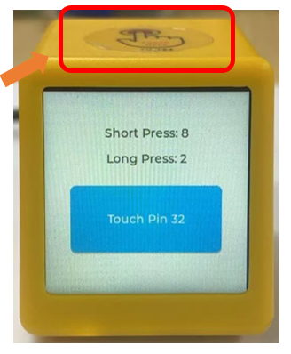

##############################################################################
Chapter 8 Lvgl Touch
##############################################################################

Project 8.1 Lvgl Touch
***********************************

Having learned about capacitive touch in previous chapters, we will now combine it with LVGL to create more intuitive interactive effects on the screen.

Component List
==================================

.. list-table::
    :align: center
    :class: table-line

    * - Freenove ESP32 Mini TV x 1
      - USB data cable x 1

    * - |List04|
      - |List05|

.. |List04| image:: ../_static/imgs/List/List04.png
.. |List05| image:: ../_static/imgs/List/List05.png

Circuit
=========================

Connect Freenove ESP32 Mini TV to the computer with USB cable.

.. image:: ../_static/imgs/2_Touch/Chapter02_01.png
    :align: center

Sketch
==========================

Open **“Sketch_08.1_LVGL_Touch”** folder under **“Freenove_ESP32_Mini_TV\\Sketch”** and double-click **“Sketch_08.1_LVGL_Touch.ino”**. 

Sketch_08.1_LVGL_Touch
--------------------------------

The following is the program code:

.. literalinclude:: ../../../freenove_Kit/Sketch/Sketch_08.1_LVGL_Touch/Sketch_08.1_LVGL_Touch.ino
    :linenos: 
    :language: C
    :dedent:

Code Explanation
----------------------------------

Include the necessary header files.

.. literalinclude:: ../../../freenove_Kit/Sketch/Sketch_08.1_LVGL_Touch/Sketch_08.1_LVGL_Touch.ino
    :linenos: 
    :language: C
    :lines: 7-8
    :dedent:

Preset basic parameters.

.. literalinclude:: ../../../freenove_Kit/Sketch/Sketch_08.1_LVGL_Touch/Sketch_08.1_LVGL_Touch.ino
    :linenos: 
    :language: C
    :lines: 11-14
    :dedent:

Define the screen resolution.

.. literalinclude:: ../../../freenove_Kit/Sketch/Sketch_08.1_LVGL_Touch/Sketch_08.1_LVGL_Touch.ino
    :linenos: 
    :language: C
    :lines: 17-18
    :dedent:

Initialize and calinrate the touch.

.. literalinclude:: ../../../freenove_Kit/Sketch/Sketch_08.1_LVGL_Touch/Sketch_08.1_LVGL_Touch.ino
    :linenos: 
    :language: C
    :lines: 74-75
    :dedent:

Initialize the screen and LVGL.

.. literalinclude:: ../../../freenove_Kit/Sketch/Sketch_08.1_LVGL_Touch/Sketch_08.1_LVGL_Touch.ino
    :linenos: 
    :language: C
    :lines: 77-78
    :dedent:

Draw the UI.

.. literalinclude:: ../../../freenove_Kit/Sketch/Sketch_08.1_LVGL_Touch/Sketch_08.1_LVGL_Touch.ino
    :linenos: 
    :language: C
    :lines: 85-116
    :dedent:

Enable the screen power supply pin.

.. literalinclude:: ../../../freenove_Kit/Sketch/Sketch_08.1_LVGL_Touch/Sketch_08.1_LVGL_Touch.ino
    :linenos: 
    :language: C
    :lines: 119-120
    :dedent:

Click **“Upload”** to upload the code to Freenove ESP32 Mini TV. Set the baud rate to 115200.

:combo:`red font-bolder:Note: The following warning messages may appear in the console during compilation. They do not affect code execution and can be safely ignored.`

When touching the capacitive touch area of the Freenode ESP32 Mini TV with a finger, a touch event lasting longer than 3 seconds is considered a long press; otherwise, it is a short press. The on-screen button displays a click animation when pressed.

Reference
----------------------------

.. c:function:: lv_obj_t * lv_button_create(lv_obj_t * parent);	
    
    This function is used to create a button component.

.. c:function:: lv_event_dsc_t * lv_obj_add_event_cb(lv_obj_t * obj, lv_event_cb_t event_cb, lv_event_code_t filter, void * user_data);	

    This function is used to bind an event callback function to an object, enabling it to listen for and respond to specific interactive behaviors.