##############################################################################
Chapter 9 Lvgl Picture
##############################################################################

Project 9.1 Lvgl Picture
************************************

Component List
====================================

.. list-table::
    :align: center
    :class: table-line

    * - Freenove ESP32 Mini TV x 1
      - USB data cable x 1

    * - |List04|
      - |List05|

.. |List04| image:: ../_static/imgs/List/List04.png
.. |List05| image:: ../_static/imgs/List/List05.png

Circuit
=====================================

Connect Freenove ESP32 Mini TV to the computer with USB cable.

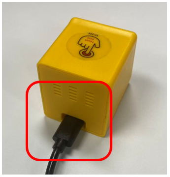

Sketch
====================================

Open **“Sketch_09.1_LVGL_Picture”** folder under **“Freenove_ESP32_Mini_TV\\Sketch”** and double-click **“Sketch_09.1_LVGL_Picture.ino”**. 

Sketch_09.1_LVGL_Picture
------------------------------------

The following is the program code:

.. literalinclude:: ../../../freenove_Kit/Sketch/Sketch_09.1_LVGL_Picture/Sketch_09.1_LVGL_Picture.ino
    :linenos: 
    :language: C
    :dedent:

Code Explanation
---------------------------

Include the necessary header files

.. literalinclude:: ../../../freenove_Kit/Sketch/Sketch_09.1_LVGL_Picture/Sketch_09.1_LVGL_Picture.ino
    :linenos: 
    :language: C
    :lines: 7-9
    :dedent:

Define image size

.. literalinclude:: ../../../freenove_Kit/Sketch/Sketch_09.1_LVGL_Picture/Sketch_09.1_LVGL_Picture.ino
    :linenos: 
    :language: C
    :lines: 12-13
    :dedent:

Define screen resolution

.. literalinclude:: ../../../freenove_Kit/Sketch/Sketch_09.1_LVGL_Picture/Sketch_09.1_LVGL_Picture.ino
    :linenos: 
    :language: C
    :lines: 14-15
    :dedent:

Set the baudrate to 115200

.. literalinclude:: ../../../freenove_Kit/Sketch/Sketch_09.1_LVGL_Picture/Sketch_09.1_LVGL_Picture.ino
    :linenos: 
    :language: C
    :lines: 55-55
    :dedent:

Drawing pictures

.. literalinclude:: ../../../freenove_Kit/Sketch/Sketch_09.1_LVGL_Picture/Sketch_09.1_LVGL_Picture.ino
    :linenos: 
    :language: C
    :lines: 66-75
    :dedent:

Enable screen power supply pin

.. literalinclude:: ../../../freenove_Kit/Sketch/Sketch_09.1_LVGL_Picture/Sketch_09.1_LVGL_Picture.ino
    :linenos: 
    :language: C
    :lines: 77-79
    :dedent:

Loop through UI tasks

.. literalinclude:: ../../../freenove_Kit/Sketch/Sketch_09.1_LVGL_Picture/Sketch_09.1_LVGL_Picture.ino
    :linenos: 
    :language: C
    :lines: 85-94
    :dedent:

Click **“Upload”** to upload the code to Freenove ESP32 Mini TV

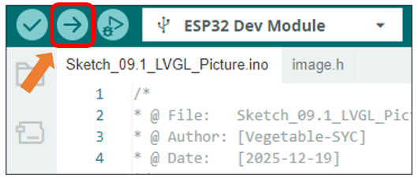

After the code is uploaded, an image will be displayed on the TFT screen

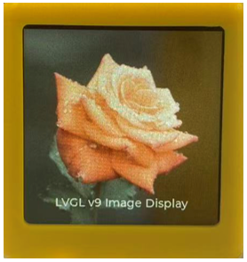

Reference

.. c:function:: lv_obj_t * lv_image_create(lv_obj_t * parent);	

    This function is used to create an image component.

.. c:function:: void lv_image_set_src(lv_obj_t * obj, const void * src);	

    This function is used to provide a data source for the image component, thereby displaying the specific image content.

Custom image display
-------------------------------------

You can customize the image displayed on the display according to your personal preferences.

First, open **Freenove_ESP32_Mini_TV\\Sketch\\Sketch_09.1_LVGL_Picture\\LVGL_img.html**

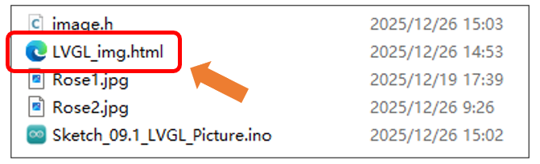

:combo:`red font-bolder:For optimal compatibility, please use Microsoft Edge or Google Chrome. You can open the file by dragging it directly into the browser window, or by right clicking it and selecting"Open with".`

**If you have any concerns, please feel free to contact us via** support@freenove.com

Click the **"Drag and drop any image"** area to select an image file, or directly drag and drop a file onto it.

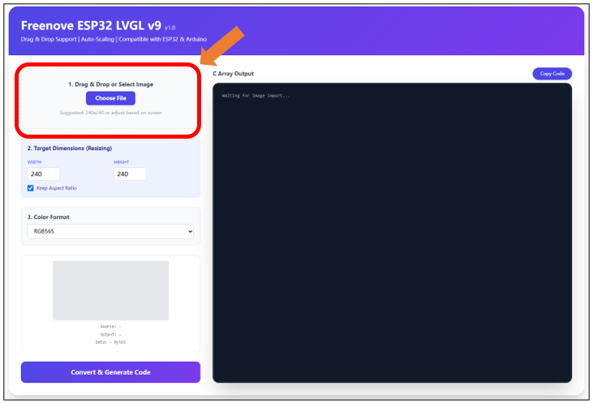

With the default settings, click **"Convert & Generate Code"** to generate the array.

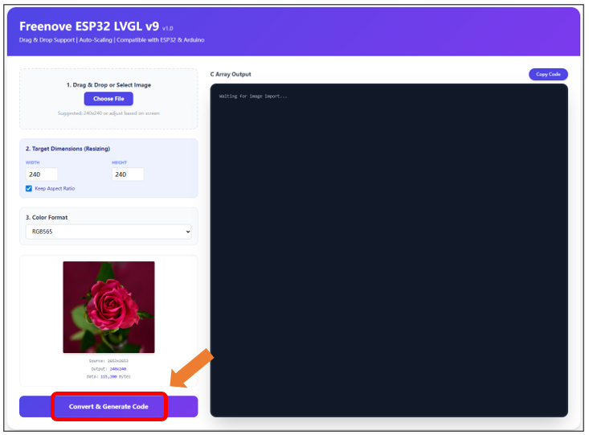

Click **“Copy Code”** to copy the arrays.

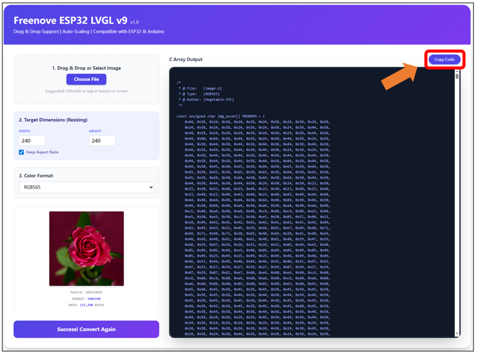

Replace all the contect in the image.h file with the copied arrays.

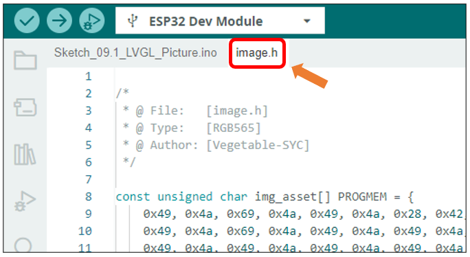

Click **“Upload”** to upload the code to Freenove ESP32 Mini TV. Set the baud rate to 115200.

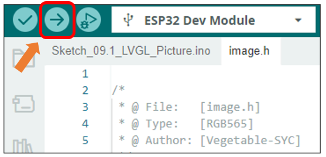

:combo:`red font-bolder:Note: The following warning messages may appear in the console during compilation. They do not affect code execution and can be safely ignored.`

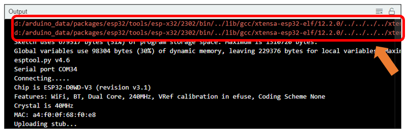

After uploading the code, the custom image will be displayed on the screen.

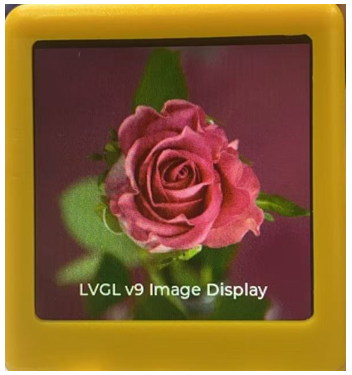