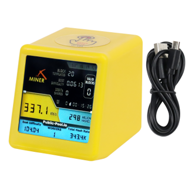
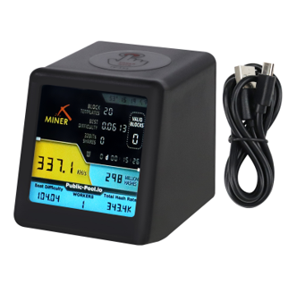
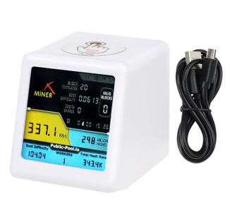
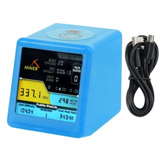

##############################################################################
List
##############################################################################

Freenove ESP32 Mini TV is currently available in four color options: **yellow, black, white, and blue**. 

It is important to note that the differences between these versions are strictly limited to the external case color. All internal components—including the hardware architecture, circuit design, and software interfaces—remain identical across all models. Therefore, regardless of which color version you use, this tutorial is fully applicable for all learning and development activities.

.. list-table::
    :align: center
    :class: table-line

    * - |List00|
      - |List01|

    * - |List02|
      - |List03|

If you have any concerns, please feel free to contact us via support@freenove.com

.. list-table::
    :align: center
    :class: table-line

    * - Freenove ESP32 Mini TV x 1
      - USB data cable x 1

    * - |List04|
      - |List05|

.. |List04| image:: ../_static/imgs/List/List04.png
.. |List05| image:: ../_static/imgs/List/List05.png