##############################################################################
Preface
##############################################################################

ESP32-WROOM
*******************************

The ESP32-WROOM offers two antenna options: the PCB on-board antenna and the IPEX antenna.

* The PCB on-board antenna is an integrated antenna within the chip module itself, making it compact and convenient for both portability and design.

* The IPEX antenna is an external metal antenna connected to the module's integrated antenna, providing enhanced signal performance.

.. list-table::
    :align: center
    :class: table-line

    * - PCB on-board antenna
      - IPEX antenna

    * - |Preface00|
      - |Preface01|

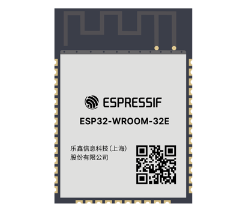
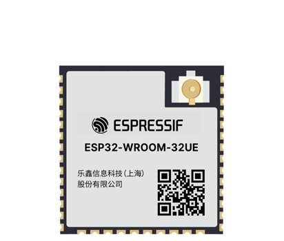

The ESP32-WROOM of this product is based on the ESP32-WROOM-32E module with built-in PCB on-board antenna. 

Freenove ESP32 Mini TV
********************************

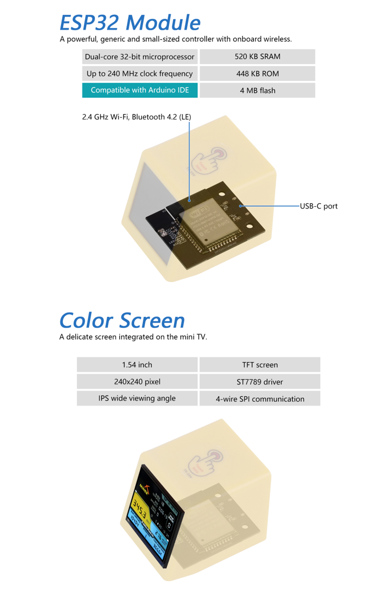

CH340 (Required)
*********************************

ESP32 uses CH340 to download codes. So before using it, we need to install CH340 driver in our computers.

Windows
==================================

Check whether CH340 has been installed
------------------------------------------

1. Connect your computer and ESP32-WROOM with a USB cable.

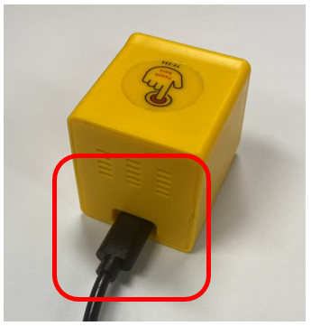

2. Turn to the main interface of your computer, select **“This PC”** and right-click to select **“Manage”**.

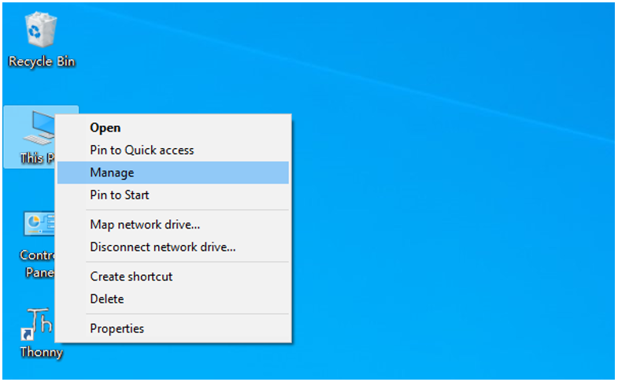

3. Click **“Device Manager”**. If your computer has installed CH340, you can see“USB-SERIAL CH340 (COMx)”. And you can click here to move to the next :ref:`step <fnk0112/codes/main/preface:programming software>`.

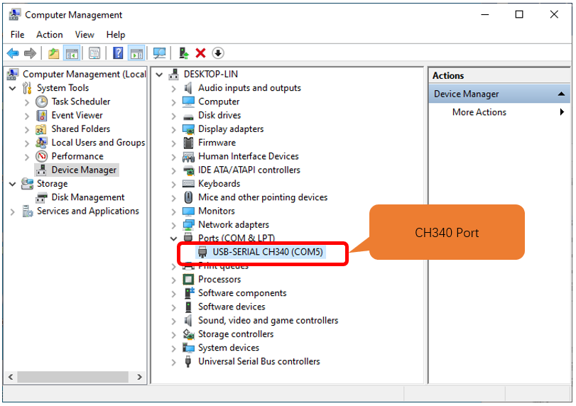

Installing CH340
-------------------------------

1. First, download CH340 driver, click http://www.wch-ic.com/search?q=CH340&t=downloads to download the appropriate one based on your operating system.

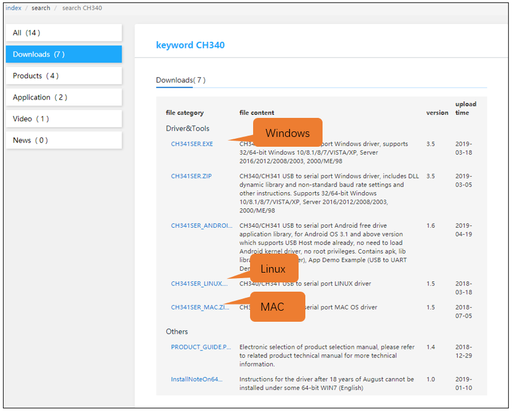

If you would not like to download the installation package, you can open **“Freenove_ESP32_Mini_TV/CH340”**, we have prepared the installation package.

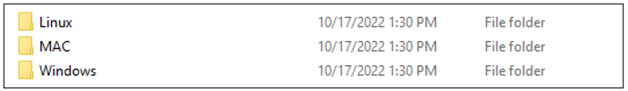

2. Open the folder **“Freenove_ESP32_Mini_TV/CH340/Windows/”**

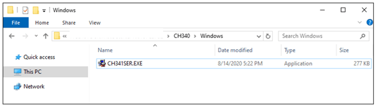

3. Double click **“CH341SER.EXE”**.

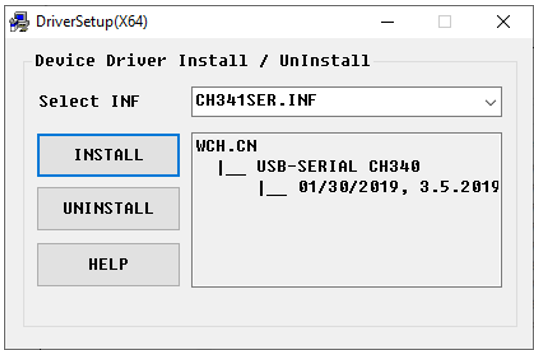

4. Click “INSTALL” and wait for the installation to complete.

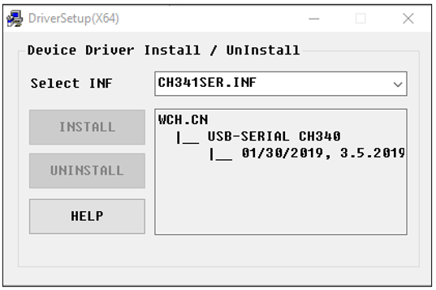

5. Install successfully. Close all interfaces.

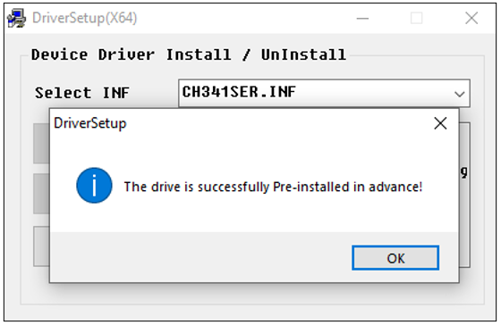

6. When ESP32 is connected to computer, select “This PC”, right-click to select “Manage” and click “Device Manager” in the newly pop-up dialog box, and you can see the following interface.

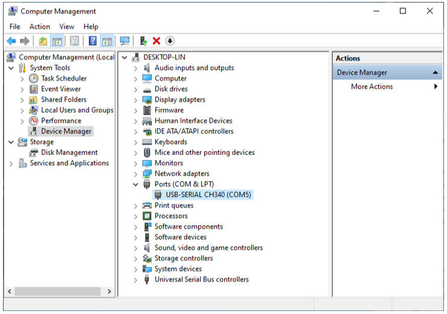

7. So far, CH340 has been installed successfully. Close all dialog boxes. 

MAC
==================================

First, download CH340 driver, click http://www.wch-ic.com/search?q=CH340&t=downloads to download the appropriate one based on your operating system.

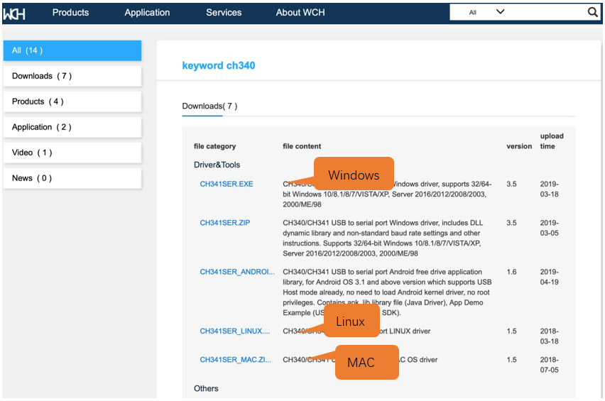

If you would not like to download the installation package, you can open **“Freenove_ESP32_Mini_TV/CH340”**, we have prepared the installation package.

Second, open the folder **“Freenove_ESP32_Mini_TV /CH340/MAC/”**

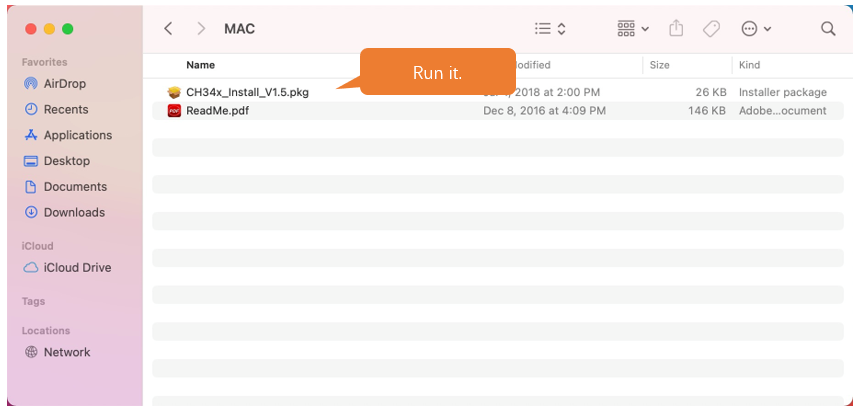

Third, click Continue.

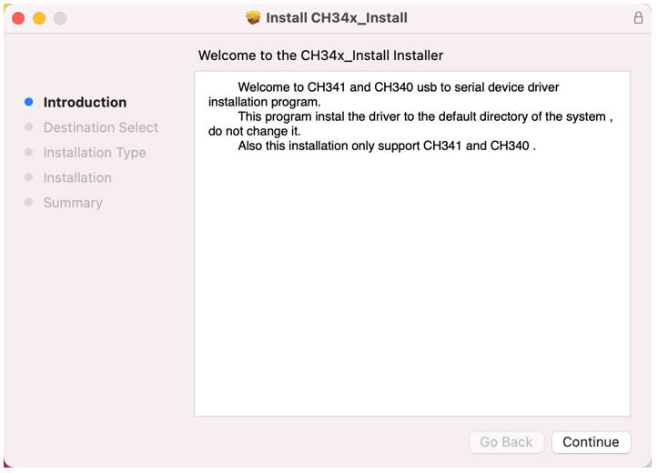

Fourth, click Install.

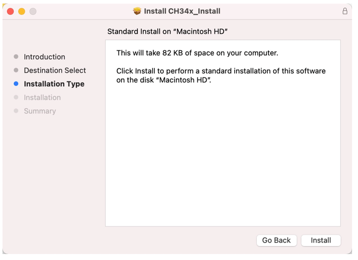

Then, waiting Finsh.

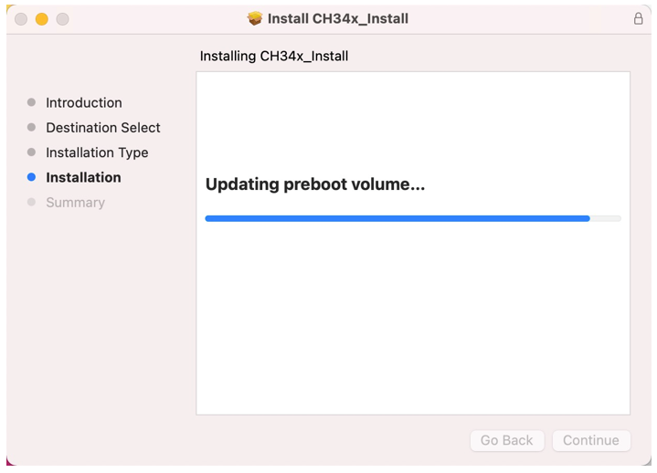

Finally, restart your PC.

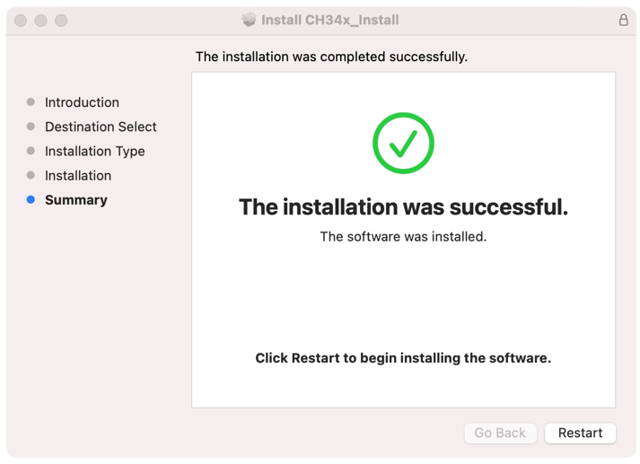

If you still haven't installed the CH340 by following the steps above, you can view readme.pdf to install it.

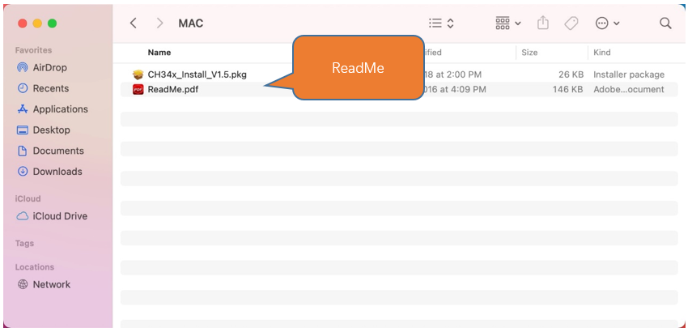

Programming Software
*****************************

Arduino Software (IDE) is used to write and upload the code for Arduino Board.

First, install Arduino Software (IDE): visit https://www.arduino.cc/en/software/

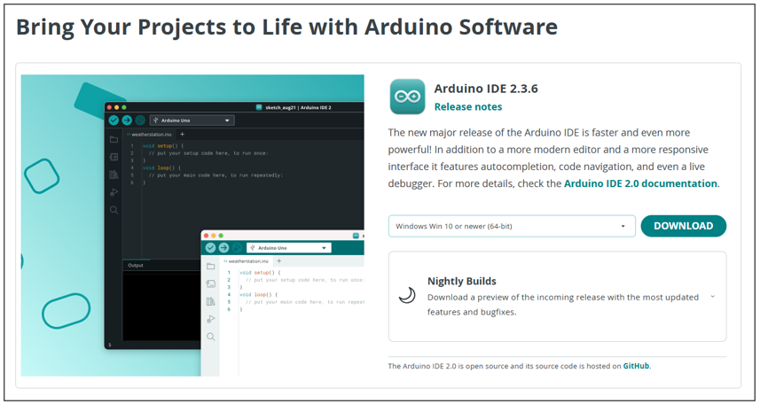

Select and download corresponding installer based on your operating system. If you are a Windows user, please select the "Windows" to download and install the driver correctly.

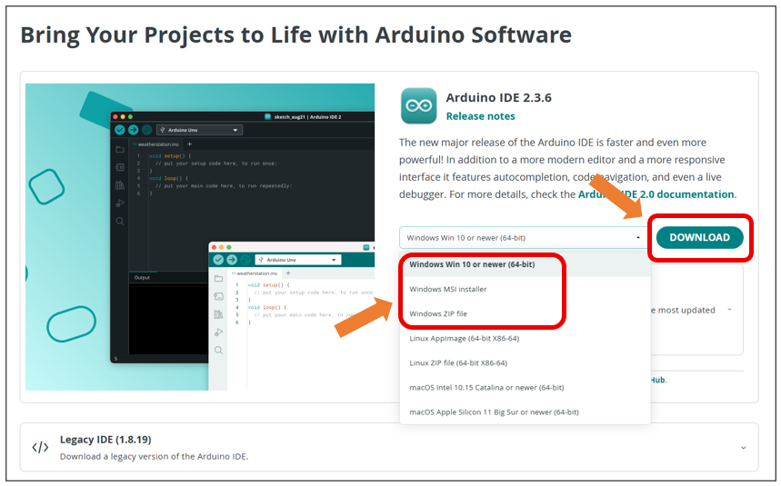

After the downloading completes, run the installer. For Windows users, there may pop up an installation dialog box of driver during the installation process. When it is popped up, please allow the installation.

After installation is completed, an shortcut will be generated in the desktop.

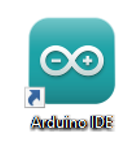

Run it. The interface of the software is as follows:

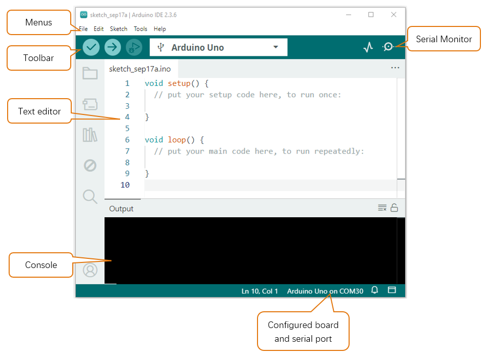

Programs written with Arduino IDE are called sketches. These sketches are written in a text editor and are saved with the file extension.ino. The editor has features for cutting/pasting and for searching/replacing text. The console displays text output by the Arduino IDE, including complete error messages and other information. The bottom right-hand corner of the window displays the configured board and serial port. The toolbar buttons allow you to verify and upload programs, open the serial monitor, and access the serial plotter.

.. table::
    :class: table-line
    :align: center

    +-------------+---------------------------------------------------------------------+
    | |Preface24| | Verify                                                              |
    |             |                                                                     |
    |             | Checks your code for errors compiling it.                           |
    +-------------+---------------------------------------------------------------------+
    | |Preface25| | Upload                                                              |
    |             |                                                                     |
    |             | Compiles your code and uploads it to the configured board.          |
    +-------------+---------------------------------------------------------------------+
    | |Preface26| | Debug                                                               |
    |             |                                                                     |
    |             | Troubleshoot code errors and monitor program running status.        |
    +-------------+---------------------------------------------------------------------+
    | |Preface27| | Serial Plotter                                                      |
    |             |                                                                     |
    |             | Real-time plotting of serial port data charts.                      |
    +-------------+---------------------------------------------------------------------+
    | |Preface28| | Serial Monitor                                                      |
    |             |                                                                     |
    |             | Used for debugging and communication between devices and computers. |
    +-------------+---------------------------------------------------------------------+

Environment Configuration
***********************************

First, open the software platform arduino, and then click File in Menus and select Preferences.

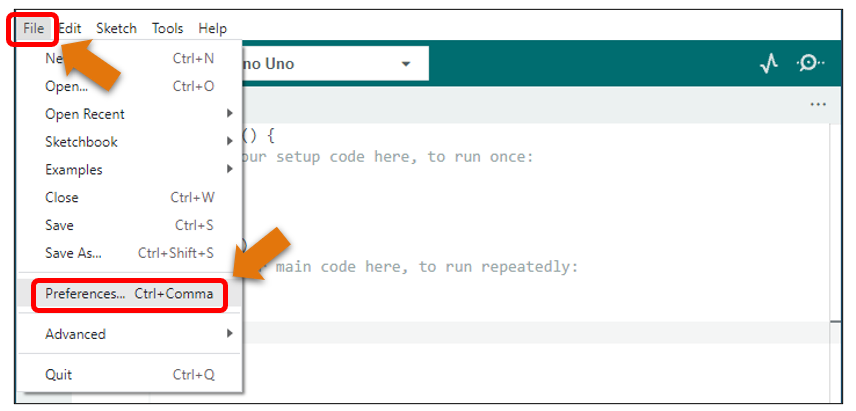

Second, click on the symbol behind "Additional Boards Manager URLs" 

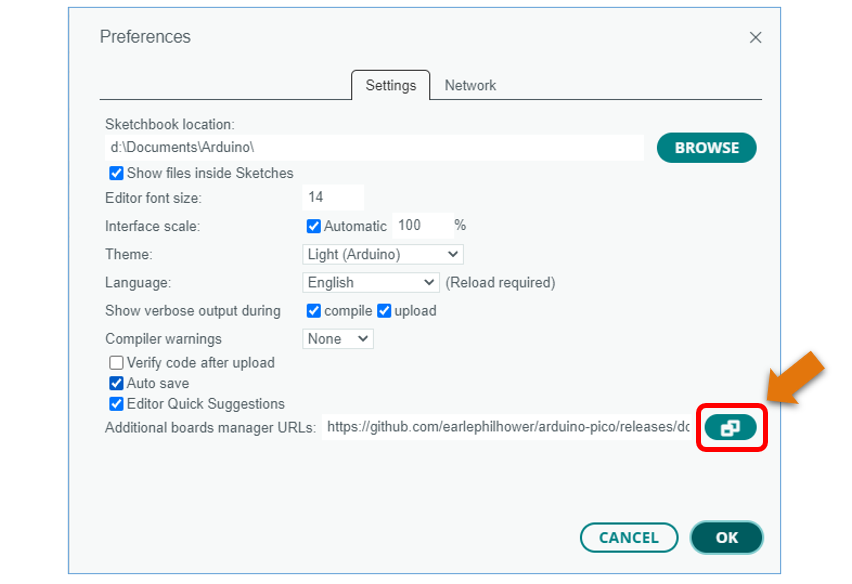

Third, fill in https://raw.githubusercontent.com/espressif/arduino-esp32/gh-pages/package_esp32_index.json in the new window, click OK, and click OK on the Preferences window again.

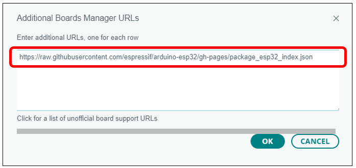

:Note: if you copy and paste the URL directly, you may lose the "-". Please check carefully to make sure the link is correct.

Fourth, click "Boards Manager". Enter “esp32” in Boards manager, select 3.0.7, and click “INSTALL”.

:combo:`red font-bolder:Please note: Repeated testing has revealed that higher versions of the board support package may cause compatibility issues with certain peripherals. It is recommended to use the more stable version 3.0.7.`

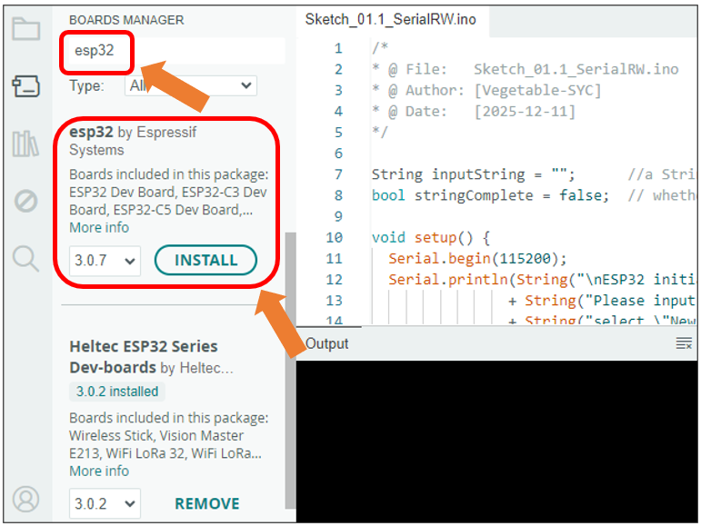

Arduino will download these files automatically. Wait for the installation to complete. 

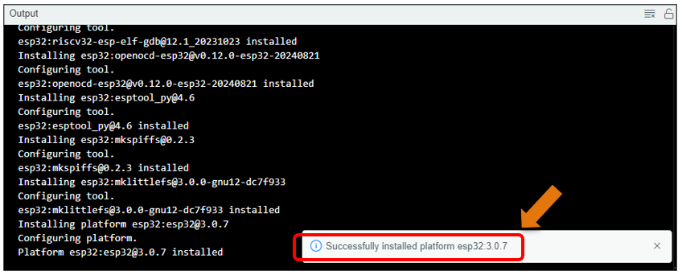

When finishing installation, click Tools in the Menus again and select Board: "ESP32 Dev Module", and then you can see information of ESP32. 

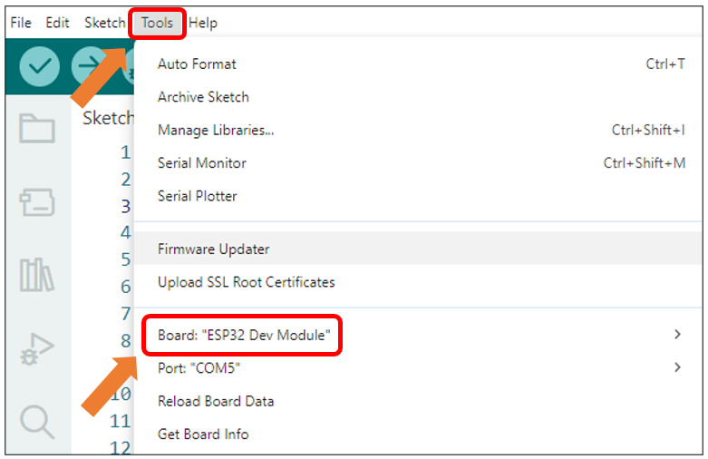

Library Installation
*******************************

Before starting the learning process, it is necessary to install some libraries in advance to enable the code to be compiled properly. For convenience, we have already packaged these libraries and placed them in the **Freenove_ESP32_Mini_TV/Libraries** folder. Please refer to the following steps to install these libraries into the Arduino IDE.

1. Open Arduino IDE.

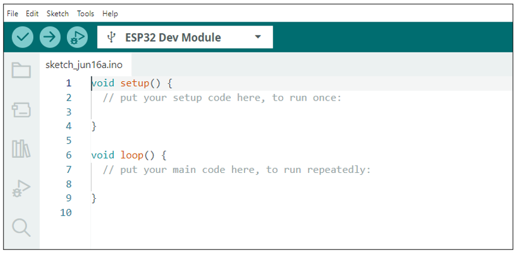

2. Select Sketch -> Include Library -> Add .ZIP library….

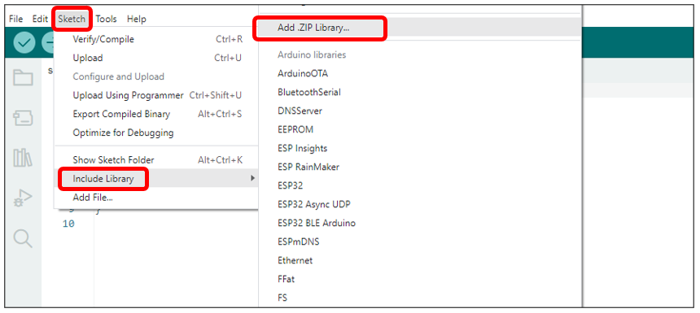

3. On the newly pop-up window, select the files from the Freenove_ESP32_Mini_TV/Libraries. Click Open to install the library.

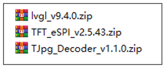

4. **Repeat the above steps until all the three libraries are installed to Arduino.** So far, all libraries have been installed.

:combo:`red font-bolder:Note: Some libraries are not the latest version. Please do not update them even if it prompts every time you open the IDE. Just click LATER. Otherwise, it may lead to compilation failure.`

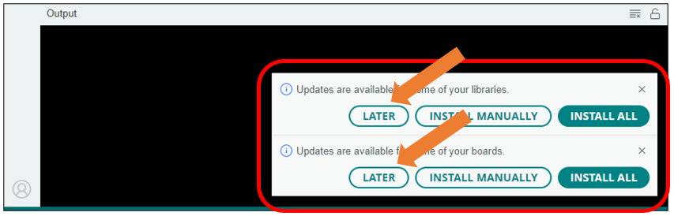