##############################################################################
NerdMiner_v2 (Freenove Miner)
##############################################################################

This project utilizes Freenove ESP32 Mini TV and NerdMiner_v2 to implement Bitcoin mining. It requires some programming background and a basic understanding of digital currencies.

Project Introduction
****************************************

NerdMiner_v2 (https://github.com/BitMaker-hub/NerdMiner_v2)is an excellent open-source BTC mining firmware designed for ESP32 development boards. Its goal is to allow users to experience the process of "mining a Bitcoin block" using a small piece of hardware. The primary aim of this project is to help more people learn about cryptocurrency mining while owning an aesthetically pleasing desktop accessory.

NerdMiner_v2 supports mining on **solo pools** by implementing the **Stratum protocol** (by default, it connects to **public-pool.io**, which supports Nerdminer devices, but the pool address can be customized). Freenove has ported this project to run on the Freenove ESP32 Mini TV.

This tutorial will guide you through the process of running the project on the Freenove ESP32 Mini TV.

Precautions
**************************************

* Cost

  - As of the time of writing this document, NerdMiner_v2 is temporarily free to use.

* Security Precautions  

  - Never disclose your wallet's private key or recovery phrase to anyone. The only information you need to provide is your public cryptocurrency receiving address.

* Troubleshooting  
  
  - If you have followed the tutorial but are still unable to use the miner, please feel free to contact us for assistance. (support@freenove.com)

Compatibility Description
**************************************

At the time of writing this guide, the Freenove ESP32 Mini TV is available in five different models. Although they vary in terms of screen drivers, resolutions, and screen sizes, all of them can be set up using this tutorial to learn how to use NerdMiner_v2.

The official firmware of NerdMiner_v2 is not fully compatible with this product. Therefore, Freenove has conducted secondary development based on it to ensure stable operation.

.. image:: ../_static/imgs/NerdMiner_v2/NerdMiner01.png
    :align: center

How to Use
******************************

Firmware Flashing 
==============================

Note: Since the official NerdMiner_v2 firmware is not compatible with this product, this tutorial only demonstrates how to flash the adapted firmware onto the product via Freenove official website. For information on the official NerdMiner_v2 firmware tool (`Bitronics Flasher <https://flasher.bitronics.store/>`_), please refer to the relevant documentation separately.

1. Open the https://freenove.com/flasher and click “**Select device**".

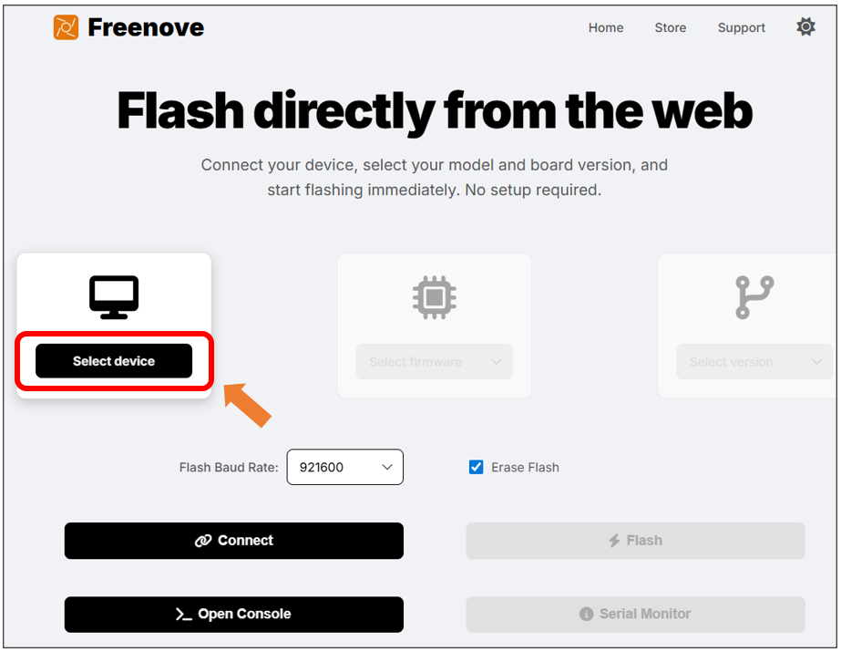

2. Select “**FNK0112**”

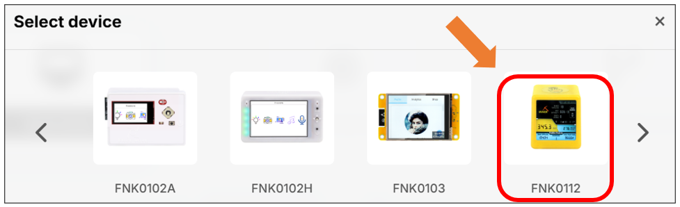

3. Click **“Select firmaware”** and select the firmware corresponding to your display model.

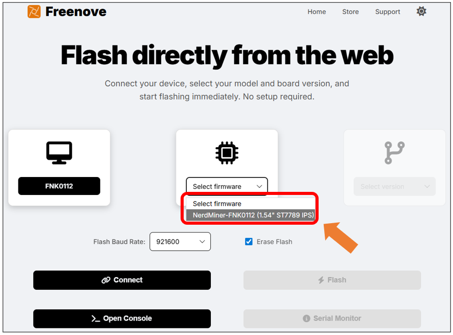

4. Click **“Select version”** to select the appropriate version.

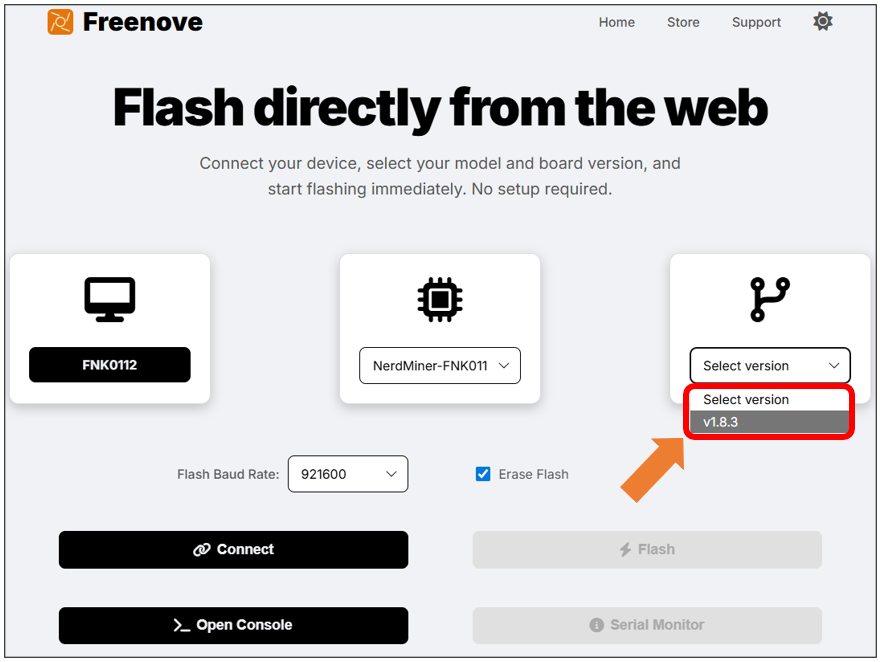

5.	Click **"Connect"**, select the correct serial port from the pop-up window in the upper left corner of the webpage, and then click **"Connect"** within that window.

.. note::

   :combo:`red font-bolder:1. The port number (e.g., COMx) is dynamically assigned by your system. The specific value (such as COM3, COM5, etc.) may differ from the example in the diagram. Please select the port that is actually displayed.`

   :combo:`red font-bolder:2. COM1 is typically not the port for the target device. Please select a different port to connect.`

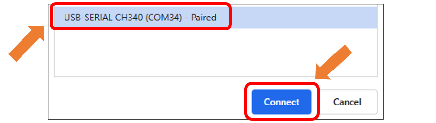

6. Click "**Flash**" to start the firmware burning process. Click "Open Console" to view the current progress.

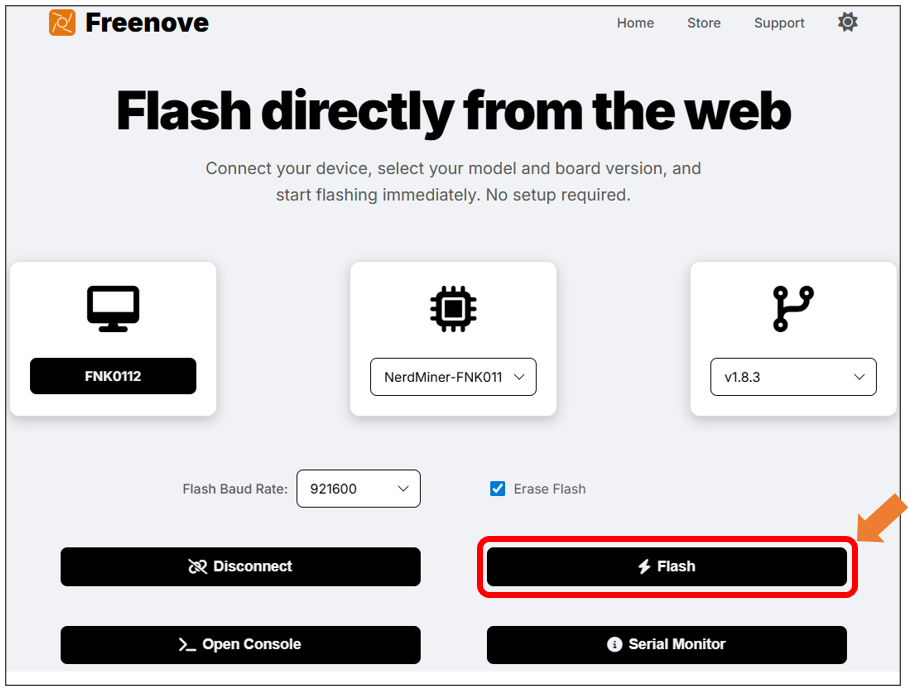

7.	The device starts flashing the firmware.

.. note::

    :combo:`red font-bolder:1. Do not disconnect the device from your computer during the firmware flashing process!`
    
    :combo:`red font-bolder:2. If the download does not start after clicking "Flash", it may be due to network latency. Try refreshing the webpage and attempting the process again.`

    :combo:`red font-bolder:3. If the "Flash" button is disabled (grayed out), please check that all previous configuration steps have been completed.`

**If you have any concerns, please feel free to contact us via** support@freenove.com

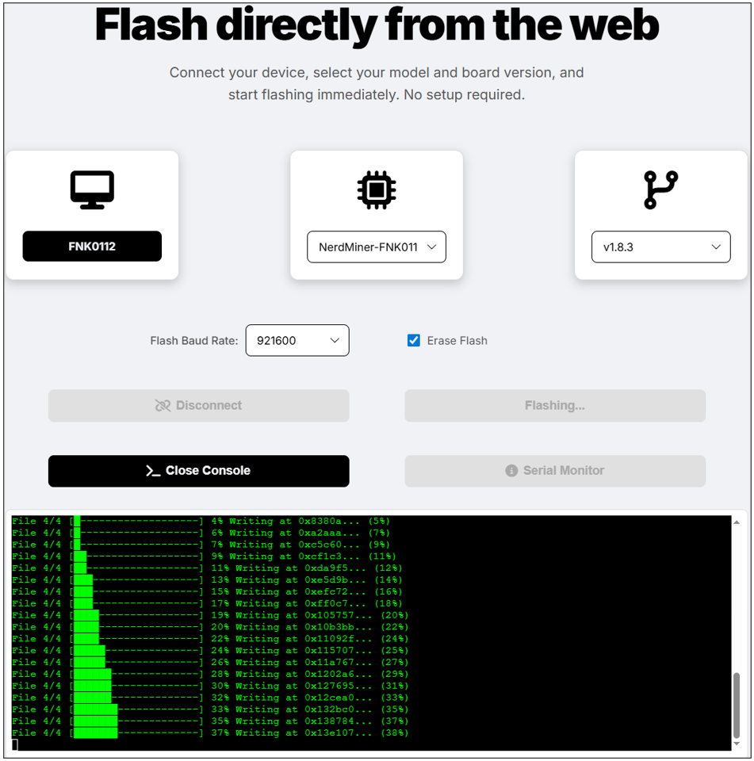

:combo:`red font-bolder:Note: During the first boot, the screen may display a solid color (e.g., white or other colors) for a few seconds. Please wait patiently, as this is normal and does not affect functionality.`

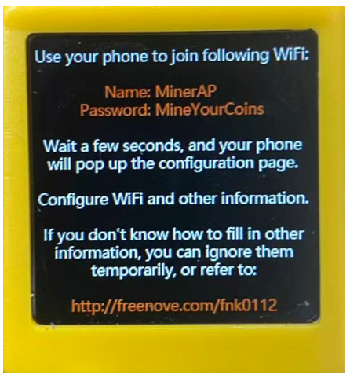

8. (Optional) Click "Serial Monitor" to open the serial monitor.

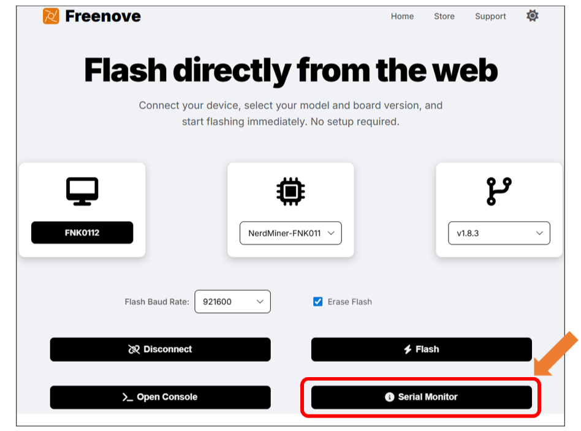

Set the baudrate to 115200, the serial monitor will output debugging information in real-time.

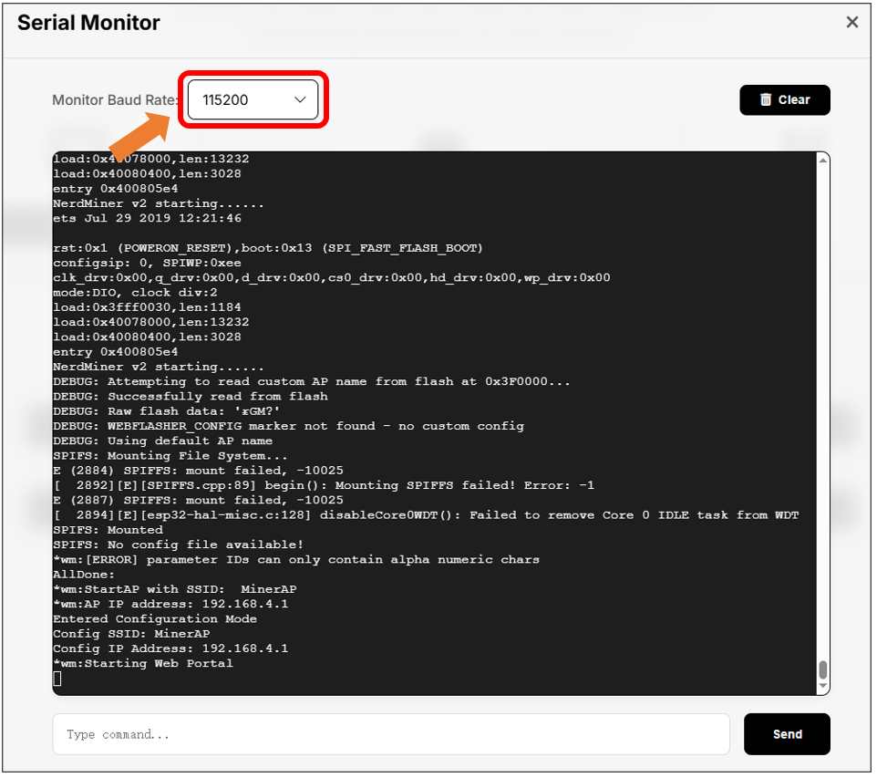

Wi-Fi Configuration
==================================

1. Connect the Freenove ESP32 Mini TV to your computer. If the firmware has not been flashed yet, please navigate back to the :ref:`Firmware Flashing Section <fnk0112/codes/miner/nerdminer_v2:how to use>` to do it.

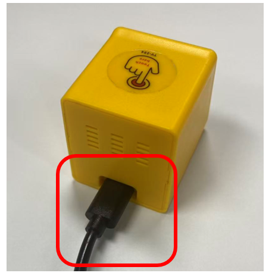

2. Turn ON WLAN and connect to **MinerAP**

WiFi SSID: :combo:`red font-bolder:MinerAP`

PASSWORD: :combo:`red font-bolder:MineYourCoins`

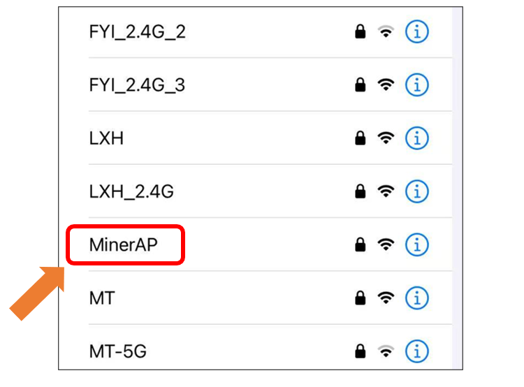

3. Click “**Configure WiFi**”

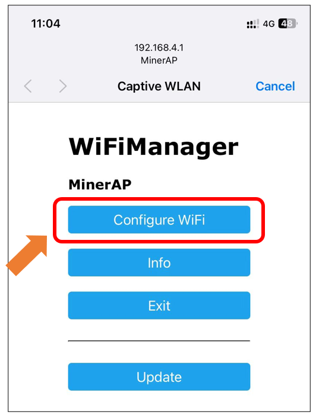

.. note::
    
    :combo:`red font-bolder:Note:If the page does not redirect automatically, please visit 192.168.4.1 in your browser.`

4. Select your network. Please note that ESP32 **only supports 2.4GHz network**.

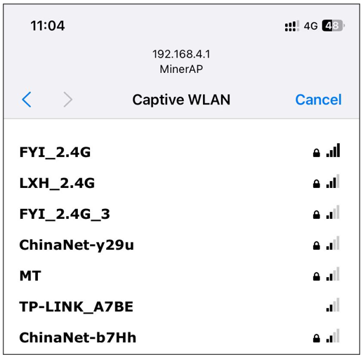

5. Configure device information.

6. If you do not have a BTC address yet, please refer to :ref:`Obtaining the BTC Receiving Address <fnk0112/codes/miner/obtaining_the_btc_receiving_address:obtaining the btc receiving address>` Section to get it. 

7. **If the mining efficiency is unsatisfactory, you can switch to** `other mining pools <https://github.com/BitMaker-hub/NerdMiner_v2?tab=readme-ov-file#pool-selection>`_ **as needed.**

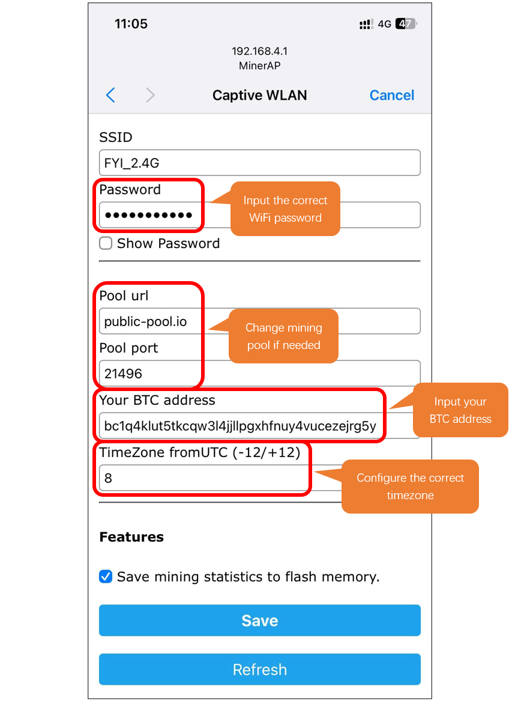

Management Tool
********************************

Public Pool
================================

When using the pool public-pool.io:21496, you can manage it via the web link https://web.public-pool.io/#/.

1. Open public-pool

.. image:: ../_static/imgs/NerdMiner_v2/NerdMiner15.png
    :align: center

2.	Enter your BTC receiving address, and click “**My Workers**”.

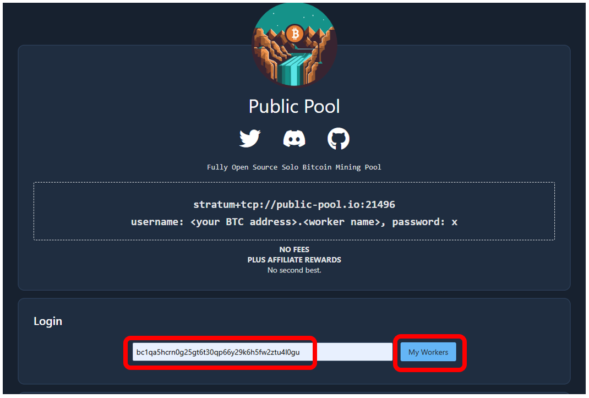

3.	You can view the current working status of the worker.

.. image:: ../_static/imgs/NerdMiner_v2/NerdMiner17.png
    :align: center

:combo:`red font-bolder:Please note: This webpage only detects and manages miners currently working in the Public Pool that use your BTC address as the login or payout address. Once the pool is changed, this webpage will no longer be accessible for management.`