##############################################################################
Obtaining the BTC Receiving Address
##############################################################################

.. note::
    
    **If you already have a BTC receiving address, feel free to skip this step. Otherwise, the following section will guide you through obtaining a new one.**

1. Click this link (https://www.exodus.com/download) to open the Exodus downloading interface. Choose the version consistent with your system.

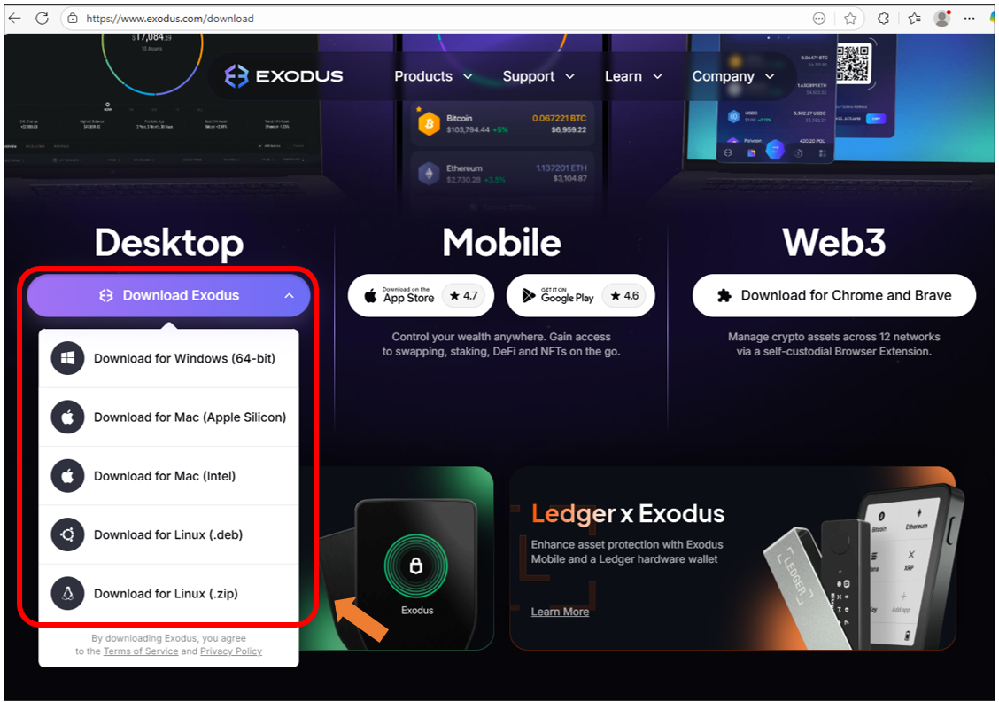

2. Open the downloaded installation package to install.

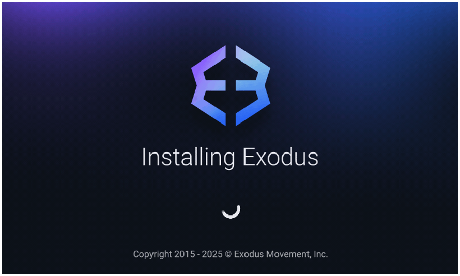

3. The following prompt indicates that the installation is successful.

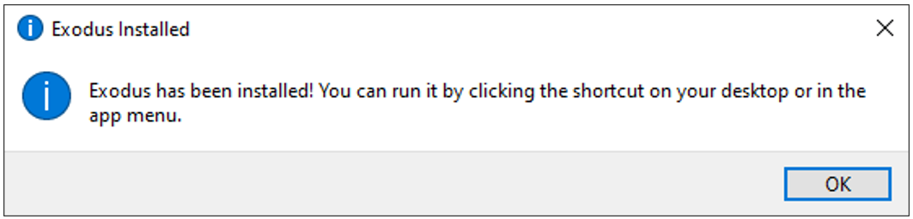

4. Open Exodus, click “**Setting**”.

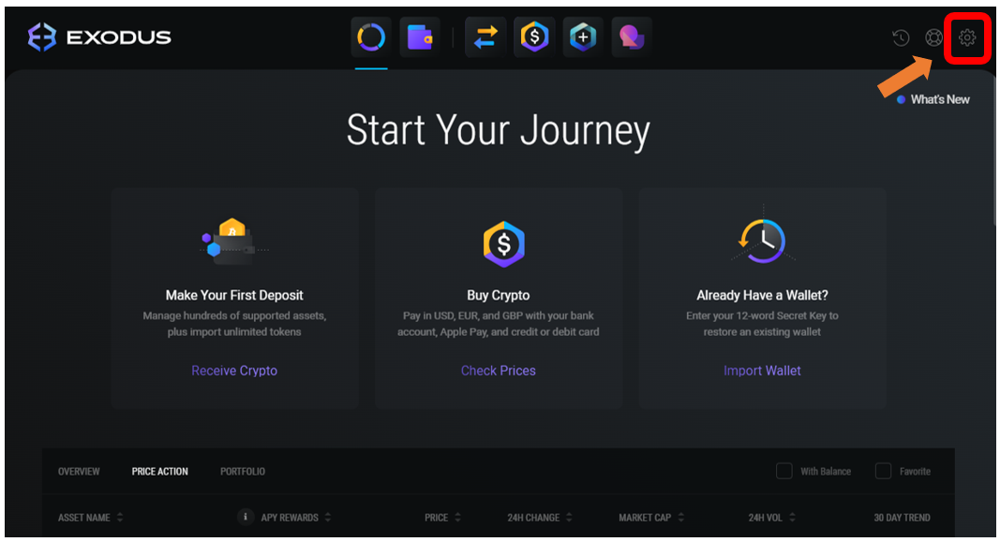

5. Click “**Backup**” to create your password for registering your wallet.

:combo:`red font-bolder:Important Note: Do not forget or share this password with anyone.`

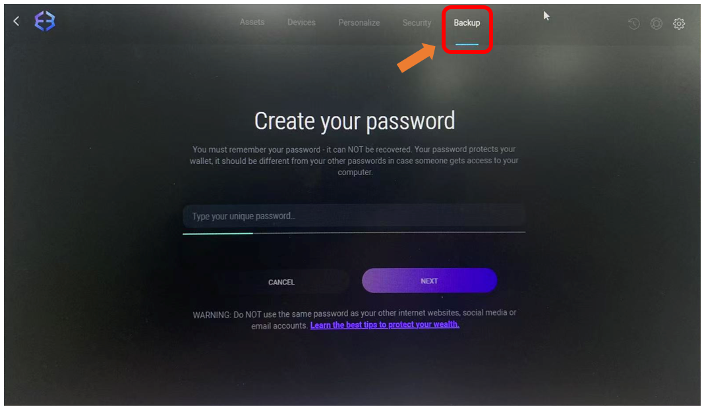

6. Click “**NEXT**”.

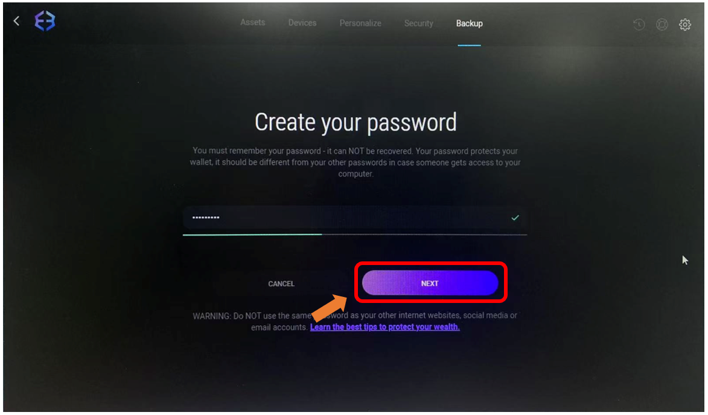

7. Enter the password again and click “**NEXT**”.

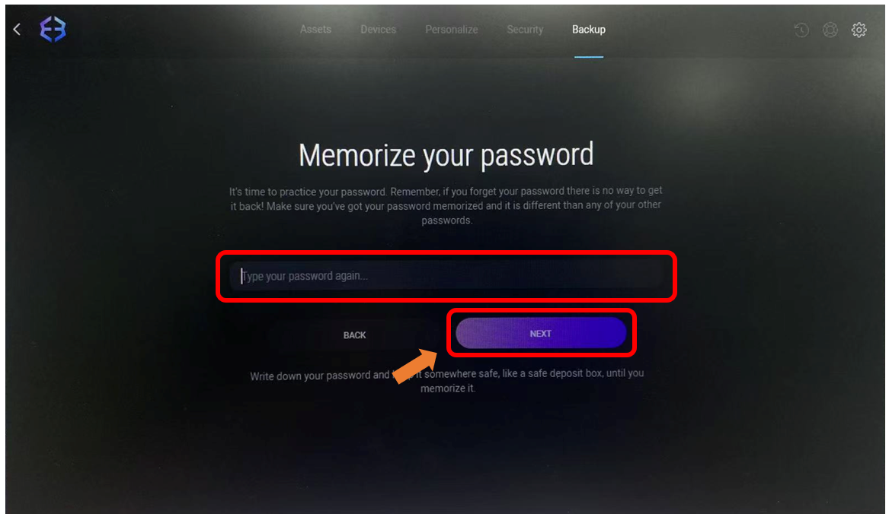

8. Check the box “**I understand the risks of sharing my Secret Key**”, and click “**VIEW SECRET KEY**”.

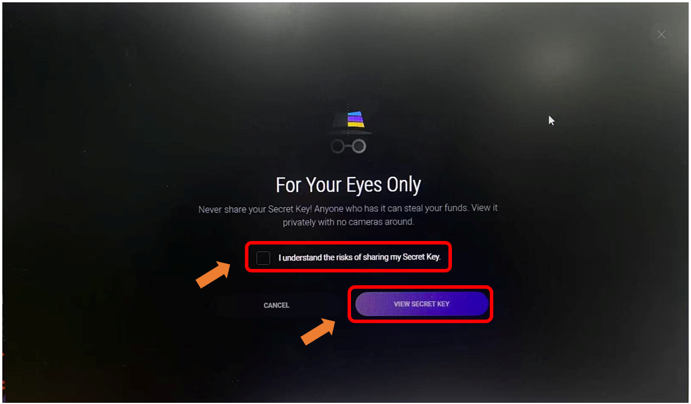

9.	Check “**Show Secret Key**”.

:combo:`red font-bolder:Please note: This interface cannot be screenshot or photographed. Do not disclose any information related to these mnemonic words to anyone. You must securely store these 12 mnemonic words corresponding to the numbers. Without them, you will permanently lose access to this wallet.`

10.	Click “**DONE**”. 

11.	Select the correct answer based on the recorded mnemonic words. Then click “**DONE**”.

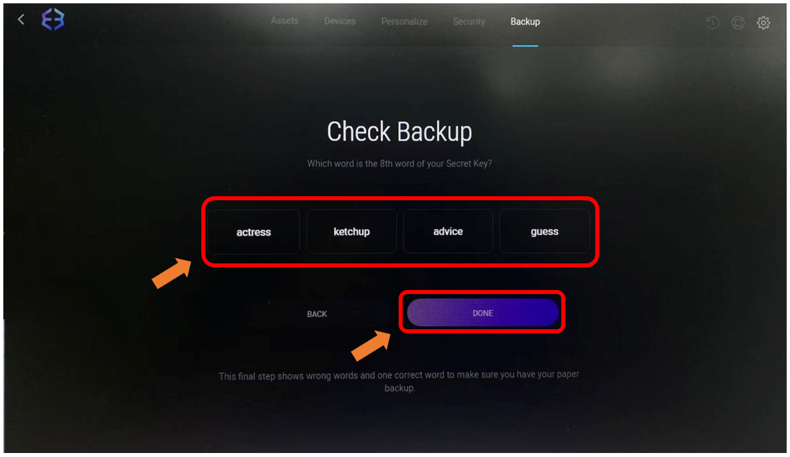

12.	So far, you have successfully created your wallet.

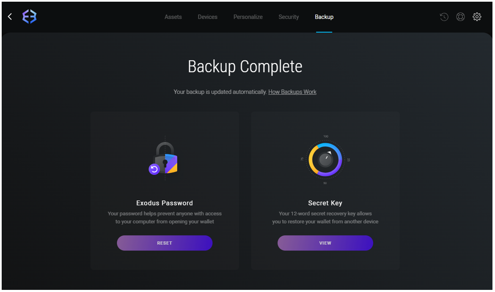

13.	Click “**Assets**”, type “**BTC**” to search, and then click “**Bitcoin**”.

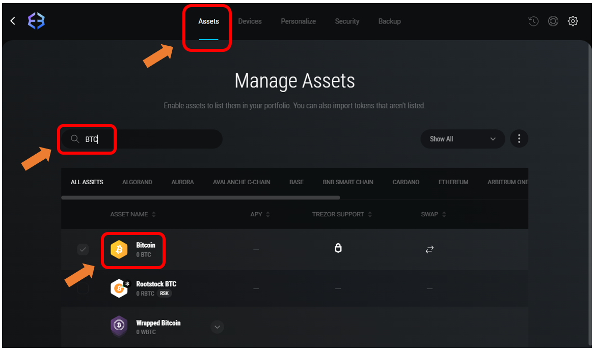

14.	Click “**Receive**”.

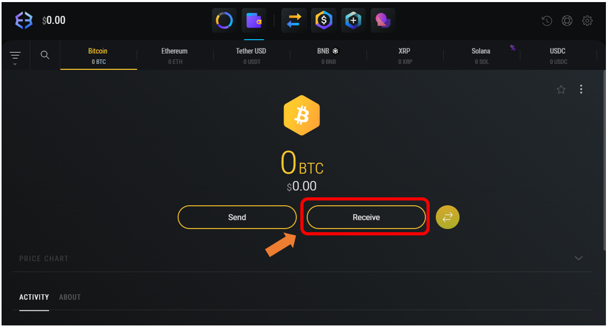

15.	The generated string of characters is a BTC address. This address can be publicly shared and is used to receive BTC.

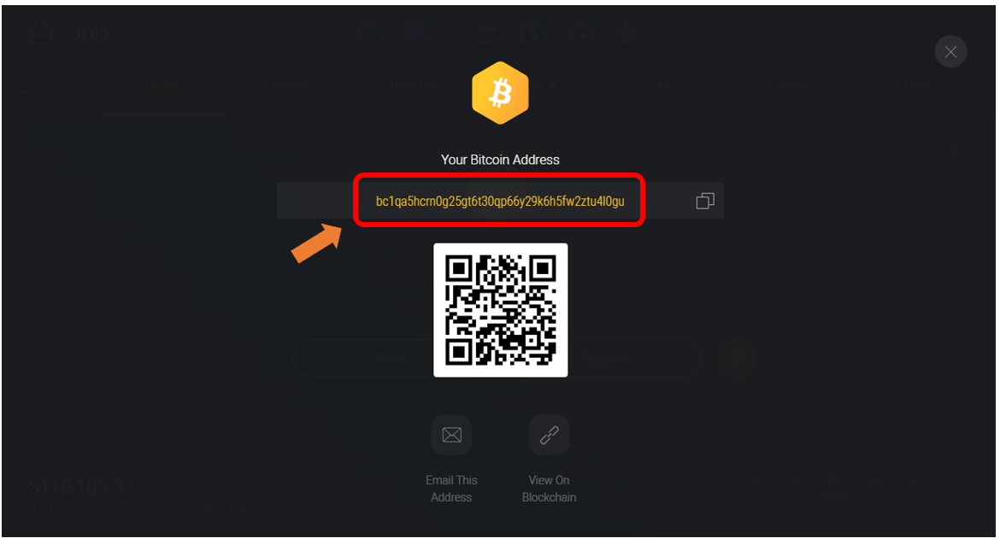

**For any Exodus-related usage questions, answers can be found at:** https://www.exodus.com/support/en/ 

**If you have any concerns, please feel free to contact us via** support@freenove.com