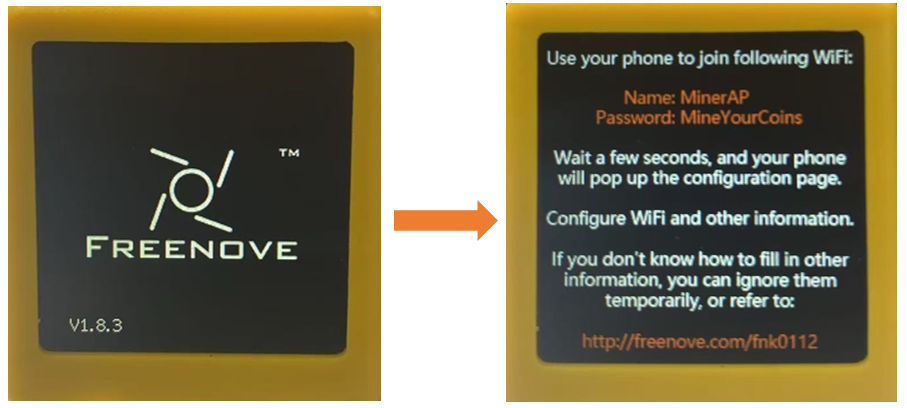
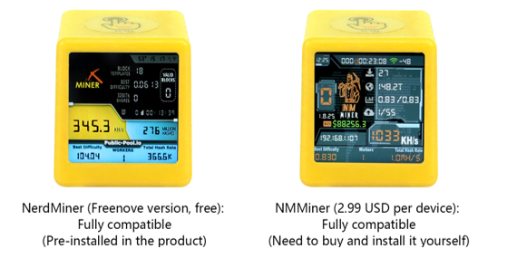

##############################################################################
Preface
##############################################################################

Important Notes
******************************

Freenove ESP32 Mini TVcomes with pre-installed firmware. Upon initial power-up, the device will behave as follows:

This is the latest firmware version we recently released (Freenove Miner), The original NerdMiner firmware is not fully compatible with FNK0112.Therefore, we have made modifications to ensure full compatibility with FNK0112, based on the original NerdMiner. We have also optimized the display, improving screen refresh smoothness and responsiveness.

**If you have any concerns, please feel free to contact us via** support@freenove.com

Miner
********************************

The firmware is our latest release (Freenove Miner), an optimized version of NerdMiner_V2. It features full compatibility with the FNK0112 display, along with enhanced refresh rate smoothness and improved response speed.

:combo:`red font-bolder:Disclaimer:`

:red:`Freenove is not the original developer of these projects. All development, maintenance, feature implementation, and commercial licensing are the sole responsibility of their respective official developers.`

